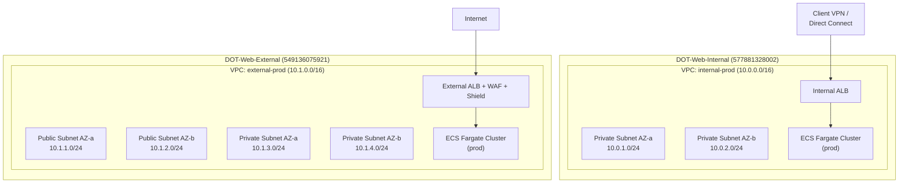
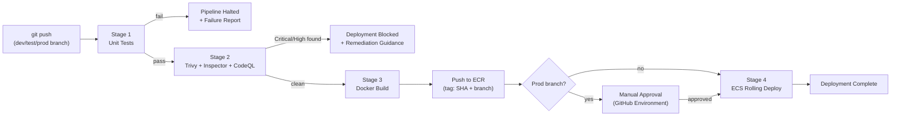

# Design Document — ODOT AWS Web Hosting POC

## Overview

This document describes the technical design for the Ohio Department of Transportation (ODOT) Web Application Hosting Proof of Concept on AWS. The platform provisions a secure, fully serverless container hosting environment across two dedicated AWS accounts using ECS Fargate, with automated CI/CD via GitHub Enterprise Actions, infrastructure-as-code via Terraform, and comprehensive observability through CloudWatch and Slack.

### Key Design Decisions

- **Terraform over CDK**: The requirements explicitly call for Terraform with S3+DynamoDB backend. The workspace steering files note CDK as an option, but Terraform is used here per the requirements specification.
- **Two-account isolation**: Internal (private) and External (public) workloads are separated at the AWS account boundary, enforced by SCPs, providing the strongest available isolation primitive.
- **Fargate-only compute**: No EC2 instances are managed. All compute is serverless Fargate, eliminating OS patching and capacity planning overhead.
- **Module-per-concern**: Terraform modules are organized by concern (networking, cluster, app-service, security, monitoring) rather than by account, enabling reuse across all six account-stage combinations.
- **OIDC authentication**: GitHub Actions authenticates to AWS via OIDC federation — no long-lived credentials are stored anywhere.

### Research Findings

- **Windows Fargate tasks** require `runtimePlatform.operatingSystemFamily = WINDOWS_SERVER_2019_CORE` (or 2022) and `cpuArchitecture = X86_64` in the task definition. Windows tasks require a minimum of 1 vCPU. Linux and Windows tasks can coexist in the same ECS cluster.
- **Fargate Spot capacity providers** are configured via `aws_ecs_cluster_capacity_providers` with a mixed strategy: `FARGATE_SPOT` at weight 1 for dev/test, `FARGATE` at weight 1 for prod. Spot tasks can be interrupted with a 2-minute warning.
- **Amazon Inspector CI/CD integration** uses the `amazon-inspector-scan` GitHub Action, which calls the Inspector Scan API to produce SBOM-based vulnerability reports without requiring Inspector to be enabled in the target account.
- **Trivy** is integrated via `aquasecurity/trivy-action` and outputs SARIF results uploadable to GitHub Advanced Security. Critical/High findings fail the pipeline via `exit-code: '1'` and `severity: 'CRITICAL,HIGH'`.
- **AWS Chatbot** (now Amazon Q Developer in chat applications) is configured via `aws_chatbot_slack_channel_configuration` Terraform resource. SNS topics route CloudWatch alarms to Chatbot, which forwards to Slack channels.
- **Multi-account Terraform** uses provider aliases with `assume_role` blocks, one per account-stage combination. State is isolated per workspace key in S3.

---

## Architecture

### High-Level Account Structure

```
AWS Organizations (Management Account)
├── OU: ODOT-Web
│   ├── DOT-Web-Internal (577881328002)   ← private workloads
│   │   ├── VPC: internal-dev   (us-east-2)
│   │   ├── VPC: internal-test  (us-east-2)
│   │   └── VPC: internal-prod  (us-east-2)
│   └── DOT-Web-External (549136075921)   ← public workloads
│       ├── VPC: external-dev   (us-east-2)
│       ├── VPC: external-test  (us-east-2)
│       └── VPC: external-prod  (us-east-2)
```

### Network Topology



### CI/CD Pipeline Flow



### Repository Structure

```
odot-aws-platform/                    # Platform IaC repository
├── modules/
│   ├── networking/                   # VPC, subnets, route tables, VPN endpoints
│   ├── ecs-cluster/                  # ECS cluster, capacity providers, Container Insights
│   ├── app-service/                  # ECS service, task def, ALB, ECR, auto-scaling, alarms
│   ├── security/                     # GuardDuty, Security Hub, Config, Macie, KMS, SCPs
│   ├── monitoring/                   # CloudWatch dashboards, SNS, Chatbot, budgets
│   └── oidc/                         # GitHub OIDC provider + IAM roles
├── stacks/
│   ├── internal-dev/                 # terraform.tfvars + backend config
│   ├── internal-test/
│   ├── internal-prod/
│   ├── external-dev/
│   ├── external-test/
│   └── external-prod/
├── docs/
│   ├── architecture/                 # Network, CI/CD, and ECS diagrams
│   └── runbook.md
└── README.md

odot-app-template/                    # Developer self-service template repository
├── .github/
│   └── workflows/
│       ├── ci-cd.yml                 # Build, scan, deploy pipeline
│       └── pr-checks.yml            # PR validation
├── terraform/
│   ├── main.tf                       # Calls app-service module
│   ├── variables.tf                  # app_name, runtime, port, etc.
│   └── terraform.tfvars.example
├── Dockerfile                        # Stub Dockerfile
├── CONTRIBUTING.md
└── README.md
```

---

## Components and Interfaces

### 1. Terraform Module: `networking`

**Purpose**: Provisions a VPC and all subnet/routing resources for one account-stage combination.

**Inputs**:
| Variable | Type | Description |
|---|---|---|
| `account_type` | `string` | `"internal"` or `"external"` |
| `stage` | `string` | `"dev"`, `"test"`, or `"prod"` |
| `vpc_cidr` | `string` | CIDR block for the VPC |
| `availability_zones` | `list(string)` | Minimum 2 AZs |
| `tags` | `map(string)` | Must include `Environment`, `Project`, `Owner` |

**Outputs**: `vpc_id`, `private_subnet_ids`, `public_subnet_ids` (empty list for internal), `vpc_cidr_block`

**Behavior**:
- Internal account: creates VPC with private subnets only, no IGW, no public subnets, no NAT gateway. Route tables have no `0.0.0.0/0` route.
- External account: creates VPC with both public subnets (IGW-attached) and private subnets (NAT gateway for egress). ALBs live in public subnets; ECS tasks live in private subnets.

### 2. Terraform Module: `ecs-cluster`

**Purpose**: Provisions one ECS cluster with Fargate capacity providers and Container Insights.

**Inputs**:
| Variable | Type | Description |
|---|---|---|
| `cluster_name` | `string` | e.g., `WebHosting-Prod` |
| `stage` | `string` | Controls Spot vs on-demand strategy |
| `tags` | `map(string)` | Resource tags |

**Outputs**: `cluster_arn`, `cluster_name`

**Behavior**:
- Always registers `FARGATE` and `FARGATE_SPOT` capacity providers.
- Dev/Test default strategy: `FARGATE_SPOT` weight=1, `FARGATE` weight=0 (base=1 for reliability).
- Prod default strategy: `FARGATE` weight=1, `FARGATE_SPOT` weight=0.
- Container Insights enabled via `setting { name = "containerInsights", value = "enabled" }`.

### 3. Terraform Module: `app-service`

**Purpose**: Provisions all per-application resources: ECR repo, ECS task definition, ECS service, ALB + target group, auto-scaling policies, CloudWatch alarms, and IAM roles.

**Inputs**:
| Variable | Type | Description |
|---|---|---|
| `app_name` | `string` | Application identifier |
| `account_type` | `string` | `"internal"` or `"external"` |
| `stage` | `string` | Deployment stage |
| `runtime` | `string` | `"linux"` or `"windows"` |
| `container_port` | `number` | Port the container listens on |
| `cpu` | `number` | Task CPU units (256–4096 for Linux; ≥1024 for Windows) |
| `memory` | `number` | Task memory in MiB |
| `cluster_arn` | `string` | Target ECS cluster |
| `private_subnet_ids` | `list(string)` | Subnets for ECS tasks |
| `alb_subnet_ids` | `list(string)` | Subnets for ALB (public for external, private for internal) |
| `vpc_id` | `string` | VPC for security groups |
| `kms_key_arn` | `string` | KMS key for ECR and log encryption |
| `waf_acl_arn` | `string` | WAF ACL ARN (required for external; empty for internal) |
| `sns_topic_arn` | `string` | SNS topic for alarm notifications |
| `tags` | `map(string)` | Resource tags |

**Outputs**: `ecr_repository_url`, `alb_dns_name`, `ecs_service_name`, `task_definition_arn`

**Key behaviors**:
- Sets `readonlyRootFilesystem = true` and `user = "1000"` (non-root) on all container definitions.
- Windows runtime: sets `runtimePlatform { operatingSystemFamily = "WINDOWS_SERVER_2019_CORE", cpuArchitecture = "X86_64" }`.
- External account: creates `aws_wafv2_web_acl_association` linking WAF ACL to ALB. This resource is created before the ALB listener is active.
- ECR lifecycle policy: rule 1 — tagged images, `countType = imageCountMoreThan`, `countNumber = 10`; rule 2 — untagged images, `countType = sinceImagePushed`, `countNumber = 7` days.
- Auto-scaling: `min_capacity = 2`, `max_capacity = 50`. Scale-out: CPU or memory > 70% for 3 minutes. Scale-in: CPU and memory < 30% for 10 minutes.
- CloudWatch log group retention: 90 days for dev/test, 365 days for prod.

### 4. Terraform Module: `security`

**Purpose**: Provisions account-wide security services: GuardDuty, Security Hub, Config, Macie, KMS keys, and SCPs.

**Inputs**: `account_type`, `account_id`, `org_id`, `tags`

**Outputs**: `kms_key_arn`, `kms_key_id`, `guardduty_detector_id`

**Key behaviors**:
- Creates one KMS CMK per account with `enable_key_rotation = true` and annual rotation.
- Enables GuardDuty detector and creates a publishing destination to Security Hub.
- Enables Security Hub with the AWS Foundational Security Best Practices (FSBP) standard.
- Enables AWS Config with a delivery channel to an S3 bucket; creates managed rules for `vpc-default-security-group-closed`, `iam-no-inline-policy`, `ecs-task-definition-nonroot-user`, and `ecs-task-definition-memory-hard-limit`.
- Enables Macie with a classification job scanning all S3 buckets in the account.
- SCPs are applied at the Organizations level (managed in the management account stack):
  - `scp-internal-no-igw.json`: Denies `ec2:CreateInternetGateway`, `ec2:AttachInternetGateway`, `ec2:CreateVpc` with public CIDR, and `elasticloadbalancing:CreateLoadBalancer` with `scheme=internet-facing`.
  - `scp-external-waf-required.json`: Denies `elasticloadbalancing:CreateLoadBalancer` unless the request includes a WAF association condition (enforced via Config rule + Lambda auto-remediation, as SCPs cannot inspect resource attributes at creation time — see Error Handling).

### 5. Terraform Module: `monitoring`

**Purpose**: Provisions CloudWatch dashboards, SNS topics, AWS Chatbot Slack integrations, and AWS Budgets.

**Inputs**: `account_type`, `stage`, `slack_workspace_id`, `slack_channel_id`, `alert_email`, `budget_limit_usd`, `tags`

**Outputs**: `sns_topic_arn`, `dashboard_name`

**Key behaviors**:
- Creates one SNS topic per account: `odot-alerts-internal` and `odot-alerts-external`.
- Creates one `aws_chatbot_slack_channel_configuration` per account pointing to the appropriate Slack channel.
- Creates one `aws_cloudwatch_dashboard` per stage per account (6 total) with widgets for: ECS task count, CPU utilization, memory utilization, ALB request count, ALB 5xx error rate, active alarm count.
- Creates `aws_budgets_budget` with `limit_amount = 1000`, `time_unit = MONTHLY`, and a notification at 80% threshold with `notification_type = FORECASTED`.

### 6. Terraform Module: `oidc`

**Purpose**: Establishes the GitHub OIDC identity provider and IAM roles for GitHub Actions.

**Inputs**: `github_org`, `github_repos`, `account_id`, `tags`

**Outputs**: `github_actions_role_arn`

**Key behaviors**:
- Creates `aws_iam_openid_connect_provider` with the GitHub OIDC thumbprint and audience `sts.amazonaws.com`.
- Creates an IAM role with a trust policy that allows `sts:AssumeRoleWithWebIdentity` from the OIDC provider, scoped to specific repository names via the `token.actions.githubusercontent.com:sub` condition.
- Attaches a least-privilege policy granting: `ecr:GetAuthorizationToken`, `ecr:BatchCheckLayerAvailability`, `ecr:PutImage`, `ecs:RegisterTaskDefinition`, `ecs:UpdateService`, `ecs:DescribeServices`, `iam:PassRole` (scoped to ECS task execution roles).

### 7. GitHub Actions Workflow: `ci-cd.yml`

**Purpose**: Automates build, scan, and deploy on every branch push.

**Trigger**: `on: push: branches: [dev, test, prod]`

**Jobs**:

| Job | Depends On | Description |
|---|---|---|
| `unit-test` | — | Run application unit tests |
| `scan` | `unit-test` | Trivy image scan + Inspector scan + CodeQL analysis |
| `build-push` | `scan` | Docker build + ECR push (tagged `{SHA}-{branch}`) |
| `deploy-dev` | `build-push` | ECS rolling deploy (branch=dev only) |
| `deploy-test` | `build-push` | ECS rolling deploy (branch=test only) |
| `deploy-prod` | `build-push` | ECS rolling deploy with manual approval gate (branch=prod only) |

**OIDC authentication** (in each job that touches AWS):
```yaml
permissions:
  id-token: write
  contents: read
steps:
  - uses: aws-actions/configure-aws-credentials@v4
    with:
      role-to-assume: ${{ vars.AWS_DEPLOY_ROLE_ARN }}
      aws-region: us-east-2
```

**Scanner gate logic** (in `scan` job):
- Trivy: `exit-code: '1'`, `severity: 'CRITICAL,HIGH'` — fails job on any Critical or High finding.
- Inspector: uses `amazon-inspector-scan` action; post-processing step parses SBOM output and fails if any finding has severity `CRITICAL` or `HIGH`.
- CodeQL: uses `github/codeql-action/analyze`; results uploaded to GitHub Advanced Security; job fails if any high-severity alert is introduced.

---

## Data Models

### Terraform State Layout

Six isolated state files, one per account-stage combination, stored in a single S3 bucket in the management account:

```
s3://odot-terraform-state-{management-account-id}/
├── internal-dev/terraform.tfstate
├── internal-test/terraform.tfstate
├── internal-prod/terraform.tfstate
├── external-dev/terraform.tfstate
├── external-test/terraform.tfstate
└── external-prod/terraform.tfstate
```

DynamoDB table `odot-terraform-locks` with partition key `LockID` (string) provides state locking. S3 bucket has versioning enabled and server-side encryption with the management account KMS key.

### ECS Task Definition Schema

Each application produces one task definition per account-stage. The task definition captures:

```hcl
# Conceptual structure — rendered by app-service module
resource "aws_ecs_task_definition" "{app_name}-{stage}" {
  family                   = "{app_name}-{stage}"
  requires_compatibilities = ["FARGATE"]
  network_mode             = "awsvpc"
  cpu                      = var.cpu
  memory                   = var.memory

  runtime_platform {
    operating_system_family = var.runtime == "windows" ? "WINDOWS_SERVER_2019_CORE" : "LINUX"
    cpu_architecture        = "X86_64"
  }

  container_definitions = jsonencode([{
    name                  = var.app_name
    image                 = "{ecr_url}:{image_tag}"
    portMappings          = [{ containerPort = var.container_port }]
    readonlyRootFilesystem = true
    user                  = "1000"   # non-root; omitted for Windows tasks
    logConfiguration = {
      logDriver = "awslogs"
      options = {
        "awslogs-group"  = "/ecs/{app_name}/{stage}"
        "awslogs-region" = "us-east-2"
        "awslogs-stream-prefix" = "ecs"
      }
    }
  }])
}
```

### ECR Image Tag Convention

Images are tagged with two tags on every push:
- `{git-commit-sha}` — immutable, 40-character SHA
- `{branch-name}-latest` — mutable, always points to the most recent build for that branch

ECS services reference the `{branch-name}-latest` tag for rolling deployments. The SHA tag is retained for audit and rollback.

### Resource Naming Convention

All resources follow the pattern `{Project}-{Environment}` per the workspace structure guidelines:

| Resource Type | Naming Pattern | Example |
|---|---|---|
| ECS Cluster | `WebHosting-{Stage}` | `WebHosting-Prod` |
| VPC | `odot-{account_type}-{stage}` | `odot-internal-prod` |
| ECR Repository | `odot-{app_name}-{account_type}` | `odot-myapp-internal` |
| CloudWatch Log Group | `/ecs/{app_name}/{stage}` | `/ecs/myapp/prod` |
| SNS Topic | `odot-alerts-{account_type}` | `odot-alerts-external` |
| KMS Key Alias | `alias/odot-{account_type}` | `alias/odot-internal` |
| IAM Role (ECS task) | `odot-ecs-task-{app_name}-{stage}` | `odot-ecs-task-myapp-prod` |
| IAM Role (GitHub Actions) | `odot-github-actions-{account_type}` | `odot-github-actions-external` |

### Tagging Schema

All resources receive these tags, enforced by the `tags` variable in every module:

| Tag Key | Value | Source |
|---|---|---|
| `Environment` | `dev` / `test` / `prod` | `var.stage` |
| `Project` | `ODOTWebHosting` | Module default |
| `Owner` | `odot-platform-team` | Module default (overridable) |

---

## Correctness Properties

*A property is a characteristic or behavior that should hold true across all valid executions of a system — essentially, a formal statement about what the system should do. Properties serve as the bridge between human-readable specifications and machine-verifiable correctness guarantees.*

The following properties are derived from the acceptance criteria prework analysis. They focus on Terraform module output correctness — verifiable by parsing the `terraform plan` JSON output or rendered HCL — which is the appropriate PBT target for an IaC-heavy feature. Properties that test AWS service behavior (GuardDuty enablement, SCP enforcement) are covered by integration tests instead.

**Property Reflection**: After initial analysis, properties 1.6 and 11.5 (resource tagging) are identical in intent and are consolidated into Property 1. Properties 3.3 and 3.5 (WAF association) are consolidated into Property 2. Properties 4.8 and 9.8 (read-only filesystem + non-root user) are consolidated into Property 3. Properties 5.2 and 5.3 (ECR scanning and encryption) are consolidated into Property 4.

---

### Property 1: All module-produced resources carry required tags

*For any* Terraform module configuration with any combination of `app_name`, `stage`, and `account_type`, every AWS resource produced in the rendered plan SHALL include non-empty `Environment`, `Project`, and `Owner` tag values.

**Validates: Requirements 1.6, 11.5**

---

### Property 2: External-account ALB configurations always include a WAF association

*For any* `app-service` module configuration where `account_type = "external"`, the rendered Terraform plan SHALL contain an `aws_wafv2_web_acl_association` resource whose `resource_arn` references the ALB created in the same configuration.

**Validates: Requirements 3.3, 3.5**

---

### Property 3: All Fargate task definitions enforce read-only filesystem and non-root execution

*For any* `app-service` module configuration with any `app_name`, `stage`, `runtime`, and `container_port`, every container definition in the rendered task definition SHALL have `readonlyRootFilesystem = true` and a non-zero (non-root) `user` value (Linux tasks only; Windows tasks are exempt from the user constraint due to platform limitations).

**Validates: Requirements 4.8, 9.8**

---

### Property 4: All ECR repositories have scan-on-push enabled and KMS encryption configured

*For any* `app-service` module configuration with any `app_name` and `account_type`, the rendered ECR repository resource SHALL have `image_scanning_configuration.scan_on_push = true` and `encryption_configuration.encryption_type = "KMS"` with a non-null `kms_key` value.

**Validates: Requirements 5.2, 5.3**

---

### Property 5: ECR lifecycle policies enforce the correct retention rules

*For any* `app-service` module configuration with any `app_name`, the rendered ECR lifecycle policy JSON SHALL contain exactly two rules: one rule retaining a maximum of 10 tagged images (`countType = "imageCountMoreThan"`, `countNumber = 10`) and one rule expiring untagged images after 7 days (`countType = "sinceImagePushed"`, `countNumber = 7`).

**Validates: Requirements 5.5**

---

### Property 6: Scanner gate correctly classifies vulnerability severity

*For any* scanner output document (Trivy JSON or Inspector SBOM), the gate evaluation function SHALL return `FAIL` if and only if the document contains at least one finding with severity `CRITICAL` or `HIGH`. For any document containing only `MEDIUM`, `LOW`, or `INFORMATIONAL` findings, the gate SHALL return `PASS`.

**Validates: Requirements 6.4**

---

### Property 7: Image tags always encode both commit SHA and branch name

*For any* `(commit_sha, branch_name)` pair provided to the tagging function, the produced set of image tags SHALL contain a tag equal to `commit_sha` and a tag equal to `{branch_name}-latest`.

**Validates: Requirements 6.5**

---

### Property 8: ECS service auto-scaling bounds are always min=2, max=50

*For any* `app-service` module configuration with any `app_name` and `stage`, the rendered `aws_appautoscaling_target` resource SHALL have `min_capacity = 2` and `max_capacity = 50`.

**Validates: Requirements 4.4**

---

### Property 9: Terraform state keys are unique per account-stage combination

*For any* two distinct `(account, stage)` pairs, the backend `key` values produced by the stack configurations SHALL be different strings, each matching the pattern `{account}-{stage}/terraform.tfstate`.

**Validates: Requirements 8.5**

---

### Property 10: CloudWatch log retention matches stage

*For any* `app-service` module configuration, the rendered `aws_cloudwatch_log_group` resource SHALL have `retention_in_days = 365` when `stage = "prod"` and `retention_in_days = 90` for all other stage values.

**Validates: Requirements 10.6**

---

### Property 11: Per-service CloudWatch alarms are always provisioned with correct thresholds

*For any* `app-service` module configuration with any `app_name` and `stage`, the rendered plan SHALL contain exactly four CloudWatch alarm resources with the following thresholds: CPU utilization > 80% (period 300s), memory utilization > 80% (period 300s), ALB 5xx error rate > 1% (period 300s), and ECS task count below minimum (threshold = 2).

**Validates: Requirements 10.3**

---

### Property 12: Internal-account VPC configurations contain no internet gateway

*For any* `networking` module configuration where `account_type = "internal"`, the rendered Terraform plan SHALL contain no `aws_internet_gateway` resource and no subnet resource with `map_public_ip_on_launch = true`.

**Validates: Requirements 2.3**

---

### Property 13: Dev and Test ECS services use Fargate Spot capacity provider

*For any* `app-service` module configuration where `stage = "dev"` or `stage = "test"`, the rendered ECS service resource SHALL include a `capacity_provider_strategy` block with `capacity_provider = "FARGATE_SPOT"` and `weight > 0`.

**Validates: Requirements 11.3**

---

### Property 14: ECS clusters always have Container Insights enabled

*For any* `ecs-cluster` module configuration with any `cluster_name` and `stage`, the rendered `aws_ecs_cluster` resource SHALL include a `setting` block with `name = "containerInsights"` and `value = "enabled"`.

**Validates: Requirements 10.1**

---

### Property 15: All KMS keys have annual key rotation enabled

*For any* `security` module configuration with any `account_type`, the rendered `aws_kms_key` resource SHALL have `enable_key_rotation = true`.

**Validates: Requirements 9.5**

---

## Error Handling

### SCP Limitation: WAF-Before-ALB Enforcement

**Problem**: SCPs can deny API calls based on request parameters, but `elasticloadbalancing:CreateLoadBalancer` does not accept a WAF ACL ARN as a parameter — WAF association is a separate API call (`wafv2:AssociateWebACL`). An SCP cannot atomically enforce "ALB must have WAF before serving traffic."

**Design Decision**: The SCP on the External_Account denies `elasticloadbalancing:CreateLoadBalancer` with `scheme = internet-facing` unless the caller has a specific IAM tag condition (`aws:RequestTag/waf-managed = true`). The `app-service` Terraform module always sets this tag and always creates the `aws_wafv2_web_acl_association` resource in the same `terraform apply`. This means:
- Manual ALB creation without the tag is blocked by SCP.
- Terraform-managed ALBs always have WAF associated within the same apply transaction.
- An AWS Config rule (`alb-waf-enabled`) provides continuous compliance monitoring and triggers a Lambda auto-remediation that associates the default WAF ACL if an ALB is found without one.

### Fargate Spot Interruption Handling

Fargate Spot tasks can be interrupted with a 2-minute warning. ECS sends a `SIGTERM` to the task, followed by `SIGKILL` after 30 seconds. Applications must handle `SIGTERM` gracefully (drain in-flight requests). The `app-service` module sets `stopTimeout = 30` on container definitions. The minimum task count of 2 ensures at least one task remains available during a Spot interruption.

### Pipeline Failure Modes

| Failure | Behavior | Recovery |
|---|---|---|
| Unit test failure | Pipeline halts at Stage 1; no image built | Developer fixes tests and re-pushes |
| Critical/High vulnerability found | Pipeline halts at Stage 2; image not pushed to ECR | Developer remediates vulnerability, re-pushes |
| Docker build failure | Pipeline halts at Stage 3 | Developer fixes Dockerfile, re-pushes |
| ECS rolling deploy failure | ECS rolls back to previous task definition automatically (circuit breaker enabled) | Investigate CloudWatch logs; re-push fixed image |
| Prod manual approval timeout | Pipeline expires after 7 days (GitHub default) | Re-trigger by re-pushing to prod branch |

### Terraform State Locking Conflicts

If a `terraform apply` is interrupted, the DynamoDB lock may remain. The lock record includes the runner identity and timestamp. Platform team members with DynamoDB write access can manually delete the lock item. The S3 bucket versioning ensures the last good state is always recoverable.

### Security Hub Finding Notification Delay

The requirement specifies notification within 5 minutes of a Critical/High Security Hub finding. The design uses EventBridge rule `aws.securityhub` → SNS → Chatbot. EventBridge delivers events within seconds; SNS to Chatbot typically adds 10–30 seconds. The 5-minute SLA is achievable under normal conditions. If Chatbot is unavailable, SNS also delivers to the email endpoint as a fallback.

### Windows Container Limitations

Windows Fargate tasks have additional constraints:
- Minimum 1 vCPU (1024 CPU units); cannot use 256 or 512.
- `readonlyRootFilesystem` is not supported on Windows containers. The `app-service` module conditionally omits this setting when `runtime = "windows"` and documents this exception.
- Windows tasks cannot run on Fargate Spot in all regions. The module falls back to `FARGATE` capacity provider for Windows tasks regardless of stage.

---

## Testing Strategy

### Overview

This platform is primarily Infrastructure as Code. The testing strategy uses a combination of:
1. **Terraform plan-based unit tests** — validate module output structure without deploying to AWS
2. **Property-based tests** — validate universal invariants across generated module configurations
3. **Integration tests** — validate actual AWS resource behavior in a sandbox environment
4. **Smoke tests** — validate one-time configuration checks post-deployment

### Property-Based Testing

**Library**: [Terratest](https://terratest.gruntwork.io/) (Go) for Terraform module testing, combined with [rapid](https://github.com/flyingmutant/rapid) for Go property-based test generation. Alternatively, Python-based tests using [Hypothesis](https://hypothesis.readthedocs.io/) with the `python-hcl2` library to parse rendered Terraform plans.

**Approach**: Each property test generates random valid inputs for a Terraform module, runs `terraform plan -out=plan.json`, parses the plan JSON, and asserts the property holds on the planned resource configurations. No AWS credentials are required — tests operate on the plan output only.

**Configuration**: Minimum 100 iterations per property test. Each test is tagged with a comment referencing the design property.

**Tag format**: `// Feature: odot-aws-web-hosting, Property {N}: {property_text}`

**Properties to implement as automated tests**:

| Property | Test File | What Varies |
|---|---|---|
| P1: Resource tagging | `test/module_tagging_test.go` | `app_name`, `stage`, `account_type`, `runtime` |
| P2: WAF association on external ALBs | `test/waf_association_test.go` | `app_name`, `account_type` |
| P3: Read-only filesystem + non-root | `test/task_security_test.go` | `app_name`, `runtime`, `cpu`, `memory` |
| P4: ECR scan-on-push + KMS | `test/ecr_config_test.go` | `app_name`, `account_type` |
| P5: ECR lifecycle policy rules | `test/ecr_lifecycle_test.go` | `app_name` |
| P6: Scanner gate severity logic | `test/scanner_gate_test.go` | Scanner output JSON with varying severities |
| P7: Image tag encoding | `test/image_tag_test.go` | `commit_sha`, `branch_name` |
| P8: Auto-scaling bounds | `test/autoscaling_test.go` | `app_name`, `stage` |
| P9: State key uniqueness | `test/state_key_test.go` | `account`, `stage` pairs |
| P10: Log retention by stage | `test/log_retention_test.go` | `app_name`, `stage` |
| P11: CloudWatch alarm thresholds | `test/alarms_test.go` | `app_name`, `stage` |
| P12: Internal VPC has no IGW | `test/internal_vpc_test.go` | `vpc_cidr`, `availability_zones` |
| P13: Fargate Spot for dev/test | `test/capacity_provider_test.go` | `app_name`, `stage` |
| P14: Container Insights enabled | `test/container_insights_test.go` | `cluster_name`, `stage` |
| P15: KMS key rotation enabled | `test/kms_rotation_test.go` | `account_type` |

### Unit Tests (Example-Based)

Unit tests cover specific scenarios and edge cases not captured by property tests:

- **Networking module**: Assert that `account_type = "internal"` produces exactly 0 public subnets and 0 IGW resources; assert that `account_type = "external"` produces at least 2 public subnets and exactly 1 IGW.
- **App-service module**: Assert that `runtime = "windows"` produces a task definition with `operatingSystemFamily = "WINDOWS_SERVER_2019_CORE"`; assert that `runtime = "linux"` produces `operatingSystemFamily = "LINUX"`.
- **OIDC module**: Assert that the trust policy condition scopes to the specific repository name, not a wildcard.
- **Scanner gate**: Assert that an empty findings document returns `PASS`; assert that a document with exactly one `CRITICAL` finding returns `FAIL`.

### Integration Tests

Run against a dedicated sandbox AWS account (separate from Internal/External accounts) after `terraform apply`:

- **SCP enforcement**: Attempt to create an IGW in the Internal_Account sandbox; verify `AccessDenied`.
- **WAF enforcement**: Attempt to create an internet-facing ALB without WAF tag; verify `AccessDenied`.
- **Inspector scan trigger**: Push a test image to ECR; verify Inspector scan is initiated within 5 minutes.
- **Alarm notification**: Trigger a CloudWatch alarm manually; verify SNS message delivered to Slack within 2 minutes.
- **Security Hub finding notification**: Inject a test finding; verify Slack notification within 5 minutes.
- **ECS task exit alarm**: Stop an ECS task manually; verify CloudWatch alarm fires within 2 minutes.
- **Terraform apply/destroy**: Run full `terraform apply` and `terraform destroy` in sandbox; verify no orphaned resources.

### Smoke Tests (Post-Deployment Validation)

Run once after each environment deployment using `aws` CLI assertions:

- Verify 6 ECS clusters exist across both accounts.
- Verify GuardDuty detector is enabled in both accounts.
- Verify Security Hub FSBP standard is active in both accounts.
- Verify AWS Budgets alert is configured at $800 threshold.
- Verify all 6 CloudWatch dashboards exist.
- Verify GitHub Actions workflow YAML contains `role-to-assume` and no `AWS_ACCESS_KEY_ID` references.
- Verify `odot-app-template` repository has `is_template = true`.

### Running Tests

```bash
# Property and unit tests (no AWS credentials needed)
cd odot-aws-platform/test
go test ./... -v -count=1

# Integration tests (requires sandbox AWS credentials)
go test ./integration/... -v -timeout 30m

# Smoke tests (requires deployed environment credentials)
./scripts/smoke-test.sh internal prod
./scripts/smoke-test.sh external prod
```
