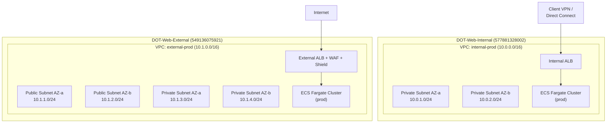
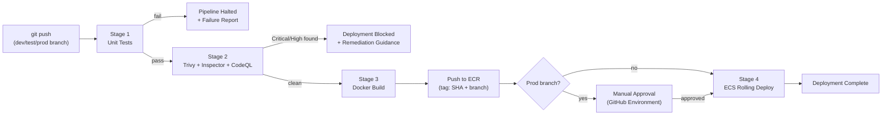

# Design Document — ODOT AWS Web Hosting POC

## Overview

This document describes the technical design for the Ohio Department of Transportation (ODOT) Web Application Hosting Proof of Concept on AWS. The platform provisions a secure, fully serverless container hosting environment across two dedicated AWS accounts using ECS Fargate, with automated CI/CD via GitHub Enterprise Actions, infrastructure-as-code via Terraform, and comprehensive observability through CloudWatch and Slack.

### Key Design Decisions

- **Terraform over CDK**: The requirements explicitly call for Terraform with S3+DynamoDB backend. The workspace steering files note CDK as an option, but Terraform is used here per the requirements specification.
- **Two-account isolation**: Internal (private) and External (public) workloads are separated at the AWS account boundary, enforced by SCPs, providing the strongest available isolation primitive.
- **Fargate-only compute**: No EC2 instances are managed. All compute is serverless Fargate, eliminating OS patching and capacity planning overhead.
- **Module-per-concern**: Terraform modules are organized by concern (networking, cluster, app-service, security, monitoring) rather than by account, enabling reuse across all six account-stage combinations.
- **OIDC authentication**: GitHub Actions authenticates to AWS via OIDC federation — no long-lived credentials are stored anywhere.

### Research Findings

- **Windows Fargate tasks** require `runtimePlatform.operatingSystemFamily = WINDOWS_SERVER_2019_CORE` (or 2022) and `cpuArchitecture = X86_64` in the task definition. Windows tasks require a minimum of 1 vCPU. Linux and Windows tasks can coexist in the same ECS cluster.
- **Fargate Spot capacity providers** are configured via `aws_ecs_cluster_capacity_providers` with a mixed strategy: `FARGATE_SPOT` at weight 1 for dev/test, `FARGATE` at weight 1 for prod. Spot tasks can be interrupted with a 2-minute warning.
- **Amazon Inspector CI/CD integration** uses the `amazon-inspector-scan` GitHub Action, which calls the Inspector Scan API to produce SBOM-based vulnerability reports without requiring Inspector to be enabled in the target account.
- **Trivy** is integrated via `aquasecurity/trivy-action` and outputs SARIF results uploadable to GitHub Advanced Security. Critical/High findings fail the pipeline via `exit-code: '1'` and `severity: 'CRITICAL,HIGH'`.
- **AWS Chatbot** (now Amazon Q Developer in chat applications) is configured via `aws_chatbot_slack_channel_configuration` Terraform resource. SNS topics route CloudWatch alarms to Chatbot, which forwards to Slack channels.
- **Multi-account Terraform** uses provider aliases with `assume_role` blocks, one per account-stage combination. State is isolated per workspace key in S3.

---

## Architecture

### High-Level Account Structure

```
AWS Organizations (Management Account)
├── OU: ODOT-Web
│   ├── DOT-Web-Internal (577881328002)   ← private workloads
│   │   ├── VPC: internal-dev   (us-east-2)
│   │   ├── VPC: internal-test  (us-east-2)
│   │   └── VPC: internal-prod  (us-east-2)
│   └── DOT-Web-External (549136075921)   ← public workloads
│       ├── VPC: external-dev   (us-east-2)
│       ├── VPC: external-test  (us-east-2)
│       └── VPC: external-prod  (us-east-2)
```

### Network Topology



### CI/CD Pipeline Flow



### Repository Structure

```
odot-aws-platform/                    # Platform IaC repository
├── modules/
│   ├── networking/                   # VPC, subnets, route tables, VPN endpoints
│   ├── ecs-cluster/                  # ECS cluster, capacity providers, Container Insights
│   ├── app-service/                  # ECS service, task def, ALB, ECR, auto-scaling, alarms
│   ├── security/                     # GuardDuty, Security Hub, Config, Macie, KMS, SCPs
│   ├── monitoring/                   # CloudWatch dashboards, SNS, Chatbot, budgets
│   └── oidc/                         # GitHub OIDC provider + IAM roles
├── stacks/
│   ├── internal-dev/                 # terraform.tfvars + backend config
│   ├── internal-test/
│   ├── internal-prod/
│   ├── external-dev/
│   ├── external-test/
│   └── external-prod/
├── docs/
│   ├── architecture/                 # Network, CI/CD, and ECS diagrams
│   └── runbook.md
└── README.md

odot-app-template/                    # Developer self-service template repository
├── .github/
│   └── workflows/
│       ├── ci-cd.yml                 # Build, scan, deploy pipeline
│       └── pr-checks.yml            # PR validation
├── terraform/
│   ├── main.tf                       # Calls app-service module
│   ├── variables.tf                  # app_name, runtime, port, etc.
│   └── terraform.tfvars.example
├── Dockerfile                        # Stub Dockerfile
├── CONTRIBUTING.md
└── README.md
```

---

## Components and Interfaces

### 1. Terraform Module: `networking`

**Purpose**: Provisions a VPC and all subnet/routing resources for one account-stage combination.

**Inputs**:
| Variable | Type | Description |
|---|---|---|
| `account_type` | `string` | `"internal"` or `"external"` |
| `stage` | `string` | `"dev"`, `"test"`, or `"prod"` |
| `vpc_cidr` | `string` | CIDR block for the VPC |
| `availability_zones` | `list(string)` | Minimum 2 AZs |
| `tags` | `map(string)` | Must include `Environment`, `Project`, `Owner` |

**Outputs**: `vpc_id`, `private_subnet_ids`, `public_subnet_ids` (empty list for internal), `vpc_cidr_block`

**Behavior**:
- Internal account: creates VPC with private subnets only, no IGW, no public subnets, no NAT gateway. Route tables have no `0.0.0.0/0` route.
- External account: creates VPC with both public subnets (IGW-attached) and private subnets (NAT gateway for egress). ALBs live in public subnets; ECS tasks live in private subnets.

### 2. Terraform Module: `ecs-cluster`

**Purpose**: Provisions one ECS cluster with Fargate capacity providers and Container Insights.

**Inputs**:
| Variable | Type | Description |
|---|---|---|
| `cluster_name` | `string` | e.g., `WebHosting-Prod` |
| `stage` | `string` | Controls Spot vs on-demand strategy |
| `tags` | `map(string)` | Resource tags |

**Outputs**: `cluster_arn`, `cluster_name`

**Behavior**:
- Always registers `FARGATE` and `FARGATE_SPOT` capacity providers.
- Dev/Test default strategy: `FARGATE_SPOT` weight=1, `FARGATE` weight=0 (base=1 for reliability).
- Prod default strategy: `FARGATE` weight=1, `FARGATE_SPOT` weight=0.
- Container Insights enabled via `setting { name = "containerInsights", value = "enabled" }`.

### 3. Terraform Module: `app-service`

**Purpose**: Provisions all per-application resources: ECR repo, ECS task definition, ECS service, ALB + target group, auto-scaling policies, CloudWatch alarms, and IAM roles.

**Inputs**:
| Variable | Type | Description |
|---|---|---|
| `app_name` | `string` | Application identifier |
| `account_type` | `string` | `"internal"` or `"external"` |
| `stage` | `string` | Deployment stage |
| `runtime` | `string` | `"linux"` or `"windows"` |
| `container_port` | `number` | Port the container listens on |
| `cpu` | `number` | Task CPU units (256–4096 for Linux; ≥1024 for Windows) |
| `memory` | `number` | Task memory in MiB |
| `cluster_arn` | `string` | Target ECS cluster |
| `private_subnet_ids` | `list(string)` | Subnets for ECS tasks |
| `alb_subnet_ids` | `list(string)` | Subnets for ALB (public for external, private for internal) |
| `vpc_id` | `string` | VPC for security groups |
| `kms_key_arn` | `string` | KMS key for ECR and log encryption |
| `waf_acl_arn` | `string` | WAF ACL ARN (required for external; empty for internal) |
| `sns_topic_arn` | `string` | SNS topic for alarm notifications |
| `tags` | `map(string)` | Resource tags |

**Outputs**: `ecr_repository_url`, `alb_dns_name`, `ecs_service_name`, `task_definition_arn`

**Key behaviors**:
- Sets `readonlyRootFilesystem = true` and `user = "1000"` (non-root) on all container definitions.
- Windows runtime: sets `runtimePlatform { operatingSystemFamily = "WINDOWS_SERVER_2019_CORE", cpuArchitecture = "X86_64" }`.
- External account: creates `aws_wafv2_web_acl_association` linking WAF ACL to ALB. This resource is created before the ALB listener is active.
- External account: AWS Shield Standard is automatically enabled on all ALBs at no additional cost and requires no explicit Terraform resource. Verification is handled by the smoke test (`aws shield describe-protection`) to satisfy Requirement 3.4.
- ECR lifecycle policy: rule 1 — tagged images, `countType = imageCountMoreThan`, `countNumber = 10`; rule 2 — untagged images, `countType = sinceImagePushed`, `countNumber = 7` days.
- Auto-scaling: `min_capacity = 2`, `max_capacity = 50`. Scale-out: CPU or memory > 70% for 3 minutes. Scale-in: CPU and memory < 30% for 10 minutes.
- CloudWatch log group retention: 90 days for dev/test, 365 days for prod.

### 4. Terraform Module: `security`

**Purpose**: Provisions account-wide security services: GuardDuty, Security Hub, Config, Macie, KMS keys, and SCPs.

**Inputs**: `account_type`, `account_id`, `org_id`, `tags`

**Outputs**: `kms_key_arn`, `kms_key_id`, `guardduty_detector_id`

**Key behaviors**:
- Creates one KMS CMK per account with `enable_key_rotation = true` and annual rotation.
- Enables GuardDuty detector and creates a publishing destination to Security Hub.
- Enables Security Hub with the AWS Foundational Security Best Practices (FSBP) standard.
- Enables AWS Config with a delivery channel to an S3 bucket; creates managed rules for `vpc-default-security-group-closed`, `iam-no-inline-policy`, `ecs-task-definition-nonroot-user`, and `ecs-task-definition-memory-hard-limit`.
- Enables Macie with a classification job scanning all S3 buckets in the account.
- SCPs are applied at the Organizations level (managed in the management account stack):
  - `scp-internal-no-igw.json`: Denies `ec2:CreateInternetGateway`, `ec2:AttachInternetGateway`, `ec2:CreateVpc` with public CIDR, and `elasticloadbalancing:CreateLoadBalancer` with `scheme=internet-facing`. **Note on Req 2.5 (public route rejection)**: The SCP does not explicitly deny `ec2:CreateRoute` with `0.0.0.0/0` because denying IGW creation and attachment makes any such route non-functional — there is no gateway target to route to. This layered defense (prevent the gateway, not just the route) is sufficient to satisfy the requirement while keeping the SCP simple and auditable.
  - `scp-external-waf-required.json`: Denies `elasticloadbalancing:CreateLoadBalancer` unless the request includes a WAF association condition (enforced via Config rule + Lambda auto-remediation, as SCPs cannot inspect resource attributes at creation time — see Error Handling).

### 5. Terraform Module: `monitoring`

**Purpose**: Provisions CloudWatch dashboards, SNS topics, AWS Chatbot Slack integrations, and AWS Budgets.

**Inputs**: `account_type`, `stage`, `slack_workspace_id`, `slack_channel_id`, `alert_email`, `budget_limit_usd`, `tags`

**Outputs**: `sns_topic_arn`, `dashboard_name`

**Key behaviors**:
- Creates one SNS topic per account: `odot-alerts-internal` and `odot-alerts-external`.
- Creates one `aws_chatbot_slack_channel_configuration` per account pointing to the appropriate Slack channel.
- Creates one `aws_cloudwatch_dashboard` per stage per account (6 total) with widgets for: ECS task count, CPU utilization, memory utilization, ALB request count, ALB 5xx error rate, active alarm count.
- Creates `aws_budgets_budget` with `limit_amount = 1000`, `time_unit = MONTHLY`, and a notification at 80% threshold with `notification_type = FORECASTED`.

### 6. Terraform Module: `oidc`

**Purpose**: Establishes the GitHub OIDC identity provider and IAM roles for GitHub Actions.

**Inputs**: `github_org`, `github_repos`, `account_id`, `tags`

**Outputs**: `github_actions_role_arn`

**Key behaviors**:
- Creates `aws_iam_openid_connect_provider` with the GitHub OIDC thumbprint and audience `sts.amazonaws.com`.
- Creates an IAM role with a trust policy that allows `sts:AssumeRoleWithWebIdentity` from the OIDC provider, scoped to specific repository names via the `token.actions.githubusercontent.com:sub` condition.
- Attaches a least-privilege policy granting: `ecr:GetAuthorizationToken`, `ecr:BatchCheckLayerAvailability`, `ecr:PutImage`, `ecs:RegisterTaskDefinition`, `ecs:UpdateService`, `ecs:DescribeServices`, `iam:PassRole` (scoped to ECS task execution roles).

### 7. GitHub Actions Workflow: `ci-cd.yml`

**Purpose**: Automates build, scan, and deploy on every branch push.

**Trigger**: `on: push: branches: [dev, test, prod]`

**Jobs**:

| Job | Depends On | Description |
|---|---|---|
| `unit-test` | — | Run application unit tests |
| `scan` | `unit-test` | Trivy image scan + Inspector scan + CodeQL analysis |
| `build-push` | `scan` | Docker build + ECR push (tagged `{SHA}-{branch}`) |
| `deploy-dev` | `build-push` | ECS rolling deploy (branch=dev only) |
| `deploy-test` | `build-push` | ECS rolling deploy (branch=test only) |
| `deploy-prod` | `build-push` | ECS rolling deploy with manual approval gate (branch=prod only) |

**OIDC authentication** (in each job that touches AWS):
```yaml
permissions:
  id-token: write
  contents: read
steps:
  - uses: aws-actions/configure-aws-credentials@v4
    with:
      role-to-assume: ${{ vars.AWS_DEPLOY_ROLE_ARN }}
      aws-region: us-east-2
```

**Scanner gate logic** (in `scan` job):
- Trivy: `exit-code: '1'`, `severity: 'CRITICAL,HIGH'` — fails job on any Critical or High finding.
- Inspector: uses `amazon-inspector-scan` action; post-processing step parses SBOM output and fails if any finding has severity `CRITICAL` or `HIGH`.
- CodeQL: uses `github/codeql-action/analyze`; results uploaded to GitHub Advanced Security; job fails if any high-severity alert is introduced.

---

## Data Models

### Terraform State Layout

Six isolated state files, one per account-stage combination, stored in a single S3 bucket in the management account:

```
s3://odot-terraform-state-{management-account-id}/
├── internal-dev/terraform.tfstate
├── internal-test/terraform.tfstate
├── internal-prod/terraform.tfstate
├── external-dev/terraform.tfstate
├── external-test/terraform.tfstate
└── external-prod/terraform.tfstate
```

DynamoDB table `odot-terraform-locks` with partition key `LockID` (string) provides state locking. S3 bucket has versioning enabled and server-side encryption with the management account KMS key.

### ECS Task Definition Schema

Each application produces one task definition per account-stage. The task definition captures:

```hcl
# Conceptual structure — rendered by app-service module
resource "aws_ecs_task_definition" "{app_name}-{stage}" {
  family                   = "{app_name}-{stage}"
  requires_compatibilities = ["FARGATE"]
  network_mode             = "awsvpc"
  cpu                      = var.cpu
  memory                   = var.memory

  runtime_platform {
    operating_system_family = var.runtime == "windows" ? "WINDOWS_SERVER_2019_CORE" : "LINUX"
    cpu_architecture        = "X86_64"
  }

  container_definitions = jsonencode([{
    name                  = var.app_name
    image                 = "{ecr_url}:{image_tag}"
    portMappings          = [{ containerPort = var.container_port }]
    readonlyRootFilesystem = true
    user                  = "1000"   # non-root; omitted for Windows tasks
    logConfiguration = {
      logDriver = "awslogs"
      options = {
        "awslogs-group"  = "/ecs/{app_name}/{stage}"
        "awslogs-region" = "us-east-2"
        "awslogs-stream-prefix" = "ecs"
      }
    }
  }])
}
```

### ECR Image Tag Convention

Images are tagged with two tags on every push:
- `{git-commit-sha}` — immutable, 40-character SHA
- `{branch-name}-latest` — mutable, always points to the most recent build for that branch

ECS services reference the `{branch-name}-latest` tag for rolling deployments. The SHA tag is retained for audit and rollback.

### Resource Naming Convention

All resources follow the pattern `{Project}-{Environment}` per the workspace structure guidelines:

| Resource Type | Naming Pattern | Example |
|---|---|---|
| ECS Cluster | `WebHosting-{Stage}` | `WebHosting-Prod` |
| VPC | `odot-{account_type}-{stage}` | `odot-internal-prod` |
| ECR Repository | `odot-{app_name}-{account_type}` | `odot-myapp-internal` |
| CloudWatch Log Group | `/ecs/{app_name}/{stage}` | `/ecs/myapp/prod` |
| SNS Topic | `odot-alerts-{account_type}` | `odot-alerts-external` |
| KMS Key Alias | `alias/odot-{account_type}` | `alias/odot-internal` |
| IAM Role (ECS task) | `odot-ecs-task-{app_name}-{stage}` | `odot-ecs-task-myapp-prod` |
| IAM Role (GitHub Actions) | `odot-github-actions-{account_type}` | `odot-github-actions-external` |

### Tagging Schema

All resources receive these tags, enforced by the `tags` variable in every module:

| Tag Key | Value | Source |
|---|---|---|
| `Environment` | `dev` / `test` / `prod` | `var.stage` |
| `Project` | `ODOTWebHosting` | Module default |
| `Owner` | `odot-platform-team` | Module default (overridable) |

---

## Correctness Properties

*A property is a characteristic or behavior that should hold true across all valid executions of a system — essentially, a formal statement about what the system should do. Properties serve as the bridge between human-readable specifications and machine-verifiable correctness guarantees.*

The following properties are derived from the acceptance criteria prework analysis. They focus on Terraform module output correctness — verifiable by parsing the `terraform plan` JSON output or rendered HCL — which is the appropriate PBT target for an IaC-heavy feature. Properties that test AWS service behavior (GuardDuty enablement, SCP enforcement) are covered by integration tests instead.

**Property Reflection**: After initial analysis, properties 1.6 and 11.5 (resource tagging) are identical in intent and are consolidated into Property 1. Properties 3.3 and 3.5 (WAF association) are consolidated into Property 2. Properties 4.8 and 9.8 (read-only filesystem + non-root user) are consolidated into Property 3. Properties 5.2 and 5.3 (ECR scanning and encryption) are consolidated into Property 4.

---

### Property 1: All module-produced resources carry required tags

*For any* Terraform module configuration with any combination of `app_name`, `stage`, and `account_type`, every AWS resource produced in the rendered plan SHALL include non-empty `Environment`, `Project`, and `Owner` tag values.

**Validates: Requirements 1.6, 11.5**

---

### Property 2: External-account ALB configurations always include a WAF association

*For any* `app-service` module configuration where `account_type = "external"`, the rendered Terraform plan SHALL contain an `aws_wafv2_web_acl_association` resource whose `resource_arn` references the ALB created in the same configuration.

**Validates: Requirements 3.3, 3.5**

---

### Property 3: All Fargate task definitions enforce read-only filesystem and non-root execution

*For any* `app-service` module configuration with any `app_name`, `stage`, `runtime`, and `container_port`, every container definition in the rendered task definition SHALL have `readonlyRootFilesystem = true` and a non-zero (non-root) `user` value (Linux tasks only; Windows tasks are exempt from the user constraint due to platform limitations).

**Validates: Requirements 4.8, 9.8**

---

### Property 4: All ECR repositories have scan-on-push enabled and KMS encryption configured

*For any* `app-service` module configuration with any `app_name` and `account_type`, the rendered ECR repository resource SHALL have `image_scanning_configuration.scan_on_push = true` and `encryption_configuration.encryption_type = "KMS"` with a non-null `kms_key` value.

**Validates: Requirements 5.2, 5.3**

---

### Property 5: ECR lifecycle policies enforce the correct retention rules

*For any* `app-service` module configuration with any `app_name`, the rendered ECR lifecycle policy JSON SHALL contain exactly two rules: one rule retaining a maximum of 10 tagged images (`countType = "imageCountMoreThan"`, `countNumber = 10`) and one rule expiring untagged images after 7 days (`countType = "sinceImagePushed"`, `countNumber = 7`).

**Validates: Requirements 5.5**

---

### Property 6: Scanner gate correctly classifies vulnerability severity

*For any* scanner output document (Trivy JSON or Inspector SBOM), the gate evaluation function SHALL return `FAIL` if and only if the document contains at least one finding with severity `CRITICAL` or `HIGH`. For any document containing only `MEDIUM`, `LOW`, or `INFORMATIONAL` findings, the gate SHALL return `PASS`.

**Validates: Requirements 6.4**

---

### Property 7: Image tags always encode both commit SHA and branch name

*For any* `(commit_sha, branch_name)` pair provided to the tagging function, the produced set of image tags SHALL contain a tag equal to `commit_sha` and a tag equal to `{branch_name}-latest`.

**Validates: Requirements 6.5**

---

### Property 8: ECS service auto-scaling bounds are always min=2, max=50

*For any* `app-service` module configuration with any `app_name` and `stage`, the rendered `aws_appautoscaling_target` resource SHALL have `min_capacity = 2` and `max_capacity = 50`.

**Validates: Requirements 4.4**

---

### Property 9: Terraform state keys are unique per account-stage combination

*For any* two distinct `(account, stage)` pairs, the backend `key` values produced by the stack configurations SHALL be different strings, each matching the pattern `{account}-{stage}/terraform.tfstate`.

**Validates: Requirements 8.5**

---

### Property 10: CloudWatch log retention matches stage

*For any* `app-service` module configuration, the rendered `aws_cloudwatch_log_group` resource SHALL have `retention_in_days = 365` when `stage = "prod"` and `retention_in_days = 90` for all other stage values.

**Validates: Requirements 10.6**

---

### Property 11: Per-service CloudWatch alarms are always provisioned with correct thresholds

*For any* `app-service` module configuration with any `app_name` and `stage`, the rendered plan SHALL contain exactly four CloudWatch alarm resources with the following thresholds: CPU utilization > 80% (period 300s), memory utilization > 80% (period 300s), ALB 5xx error rate > 1% (period 300s), and ECS task count below minimum (threshold = 2).

**Validates: Requirements 10.3**

---

### Property 12: Internal-account VPC configurations contain no internet gateway

*For any* `networking` module configuration where `account_type = "internal"`, the rendered Terraform plan SHALL contain no `aws_internet_gateway` resource and no subnet resource with `map_public_ip_on_launch = true`.

**Validates: Requirements 2.3**

---

### Property 13: Dev and Test ECS services use Fargate Spot capacity provider

*For any* `app-service` module configuration where `stage = "dev"` or `stage = "test"`, the rendered ECS service resource SHALL include a `capacity_provider_strategy` block with `capacity_provider = "FARGATE_SPOT"` and `weight > 0`.

**Validates: Requirements 11.3**

---

### Property 14: ECS clusters always have Container Insights enabled

*For any* `ecs-cluster` module configuration with any `cluster_name` and `stage`, the rendered `aws_ecs_cluster` resource SHALL include a `setting` block with `name = "containerInsights"` and `value = "enabled"`.

**Validates: Requirements 10.1**

---

### Property 15: All KMS keys have annual key rotation enabled

*For any* `security` module configuration with any `account_type`, the rendered `aws_kms_key` resource SHALL have `enable_key_rotation = true`.

**Validates: Requirements 9.5**

---

## Error Handling

### SCP Limitation: WAF-Before-ALB Enforcement

**Problem**: SCPs can deny API calls based on request parameters, but `elasticloadbalancing:CreateLoadBalancer` does not accept a WAF ACL ARN as a parameter — WAF association is a separate API call (`wafv2:AssociateWebACL`). An SCP cannot atomically enforce "ALB must have WAF before serving traffic."

**Design Decision**: The SCP on the External_Account denies `elasticloadbalancing:CreateLoadBalancer` with `scheme = internet-facing` unless the caller has a specific IAM tag condition (`aws:RequestTag/waf-managed = true`). The `app-service` Terraform module always sets this tag and always creates the `aws_wafv2_web_acl_association` resource in the same `terraform apply`. This means:
- Manual ALB creation without the tag is blocked by SCP.
- Terraform-managed ALBs always have WAF associated within the same apply transaction.
- An AWS Config rule (`alb-waf-enabled`) provides continuous compliance monitoring and triggers a Lambda auto-remediation that associates the default WAF ACL if an ALB is found without one.

### Fargate Spot Interruption Handling

Fargate Spot tasks can be interrupted with a 2-minute warning. ECS sends a `SIGTERM` to the task, followed by `SIGKILL` after 30 seconds. Applications must handle `SIGTERM` gracefully (drain in-flight requests). The `app-service` module sets `stopTimeout = 30` on container definitions. The minimum task count of 2 ensures at least one task remains available during a Spot interruption.

### Pipeline Failure Modes

| Failure | Behavior | Recovery |
|---|---|---|
| Unit test failure | Pipeline halts at Stage 1; no image built | Developer fixes tests and re-pushes |
| Critical/High vulnerability found | Pipeline halts at Stage 2; image not pushed to ECR | Developer remediates vulnerability, re-pushes |
| Docker build failure | Pipeline halts at Stage 3 | Developer fixes Dockerfile, re-pushes |
| ECS rolling deploy failure | ECS rolls back to previous task definition automatically (circuit breaker enabled) | Investigate CloudWatch logs; re-push fixed image |
| Prod manual approval timeout | Pipeline expires after 7 days (GitHub default) | Re-trigger by re-pushing to prod branch |

### Terraform State Locking Conflicts

If a `terraform apply` is interrupted, the DynamoDB lock may remain. The lock record includes the runner identity and timestamp. Platform team members with DynamoDB write access can manually delete the lock item. The S3 bucket versioning ensures the last good state is always recoverable.

### Security Hub Finding Notification Delay

The requirement specifies notification within 5 minutes of a Critical/High Security Hub finding. The design uses EventBridge rule `aws.securityhub` → SNS → Chatbot. EventBridge delivers events within seconds; SNS to Chatbot typically adds 10–30 seconds. The 5-minute SLA is achievable under normal conditions. If Chatbot is unavailable, SNS also delivers to the email endpoint as a fallback.

### Windows Container Limitations

Windows Fargate tasks have additional constraints:
- Minimum 1 vCPU (1024 CPU units); cannot use 256 or 512.
- `readonlyRootFilesystem` is not supported on Windows containers. The `app-service` module conditionally omits this setting when `runtime = "windows"` and documents this exception.
- Windows tasks cannot run on Fargate Spot in all regions. The module falls back to `FARGATE` capacity provider for Windows tasks regardless of stage.

---

## Testing Strategy

### Overview

This platform is primarily Infrastructure as Code. The testing strategy uses a combination of:
1. **Terraform plan-based unit tests** — validate module output structure without deploying to AWS
2. **Property-based tests** — validate universal invariants across generated module configurations
3. **Integration tests** — validate actual AWS resource behavior in a sandbox environment
4. **Smoke tests** — validate one-time configuration checks post-deployment

### Property-Based Testing

**Library**: [Terratest](https://terratest.gruntwork.io/) (Go) for Terraform module testing, combined with [rapid](https://github.com/flyingmutant/rapid) for Go property-based test generation. Alternatively, Python-based tests using [Hypothesis](https://hypothesis.readthedocs.io/) with the `python-hcl2` library to parse rendered Terraform plans.

**Approach**: Each property test generates random valid inputs for a Terraform module, runs `terraform plan -out=plan.json`, parses the plan JSON, and asserts the property holds on the planned resource configurations. No AWS credentials are required — tests operate on the plan output only.

**Configuration**: Minimum 100 iterations per property test. Each test is tagged with a comment referencing the design property.

**Tag format**: `// Feature: odot-aws-web-hosting, Property {N}: {property_text}`

**Properties to implement as automated tests**:

| Property | Test File | What Varies |
|---|---|---|
| P1: Resource tagging | `test/module_tagging_test.go` | `app_name`, `stage`, `account_type`, `runtime` |
| P2: WAF association on external ALBs | `test/waf_association_test.go` | `app_name`, `account_type` |
| P3: Read-only filesystem + non-root | `test/task_security_test.go` | `app_name`, `runtime`, `cpu`, `memory` |
| P4: ECR scan-on-push + KMS | `test/ecr_config_test.go` | `app_name`, `account_type` |
| P5: ECR lifecycle policy rules | `test/ecr_lifecycle_test.go` | `app_name` |
| P6: Scanner gate severity logic | `test/scanner_gate_test.go` | Scanner output JSON with varying severities |
| P7: Image tag encoding | `test/image_tag_test.go` | `commit_sha`, `branch_name` |
| P8: Auto-scaling bounds | `test/autoscaling_test.go` | `app_name`, `stage` |
| P9: State key uniqueness | `test/state_key_test.go` | `account`, `stage` pairs |
| P10: Log retention by stage | `test/log_retention_test.go` | `app_name`, `stage` |
| P11: CloudWatch alarm thresholds | `test/alarms_test.go` | `app_name`, `stage` |
| P12: Internal VPC has no IGW | `test/internal_vpc_test.go` | `vpc_cidr`, `availability_zones` |
| P13: Fargate Spot for dev/test | `test/capacity_provider_test.go` | `app_name`, `stage` |
| P14: Container Insights enabled | `test/container_insights_test.go` | `cluster_name`, `stage` |
| P15: KMS key rotation enabled | `test/kms_rotation_test.go` | `account_type` |

### Unit Tests (Example-Based)

Unit tests cover specific scenarios and edge cases not captured by property tests:

- **Networking module**: Assert that `account_type = "internal"` produces exactly 0 public subnets and 0 IGW resources; assert that `account_type = "external"` produces at least 2 public subnets and exactly 1 IGW.
- **App-service module**: Assert that `runtime = "windows"` produces a task definition with `operatingSystemFamily = "WINDOWS_SERVER_2019_CORE"`; assert that `runtime = "linux"` produces `operatingSystemFamily = "LINUX"`.
- **OIDC module**: Assert that the trust policy condition scopes to the specific repository name, not a wildcard.
- **Scanner gate**: Assert that an empty findings document returns `PASS`; assert that a document with exactly one `CRITICAL` finding returns `FAIL`.

### Integration Tests

Run against a dedicated sandbox AWS account (separate from Internal/External accounts) after `terraform apply`:

- **SCP enforcement**: Attempt to create an IGW in the Internal_Account sandbox; verify `AccessDenied`.
- **WAF enforcement**: Attempt to create an internet-facing ALB without WAF tag; verify `AccessDenied`.
- **Inspector scan trigger**: Push a test image to ECR; verify Inspector scan is initiated within 5 minutes.
- **Alarm notification**: Trigger a CloudWatch alarm manually; verify SNS message delivered to Slack within 2 minutes.
- **Security Hub finding notification**: Inject a test finding; verify Slack notification within 5 minutes.
- **ECS task exit alarm**: Stop an ECS task manually; verify CloudWatch alarm fires within 2 minutes.
- **Terraform apply/destroy**: Run full `terraform apply` and `terraform destroy` in sandbox; verify no orphaned resources.

### Smoke Tests (Post-Deployment Validation)

Run once after each environment deployment using `aws` CLI assertions:

- Verify 6 ECS clusters exist across both accounts.
- Verify GuardDuty detector is enabled in both accounts.
- Verify Security Hub FSBP standard is active in both accounts.
- Verify AWS Budgets alert is configured at $800 threshold.
- Verify all 6 CloudWatch dashboards exist.
- Verify GitHub Actions workflow YAML contains `role-to-assume` and no `AWS_ACCESS_KEY_ID` references.
- Verify `odot-app-template` repository has `is_template = true`.

### Running Tests

```bash
# Property and unit tests (no AWS credentials needed)
cd odot-aws-platform/test
go test ./... -v -count=1

# Integration tests (requires sandbox AWS credentials)
go test ./integration/... -v -timeout 30m

# Smoke tests (requires deployed environment credentials)
./scripts/smoke-test.sh internal prod
./scripts/smoke-test.sh external prod
```

---

## Component 8: Admin Operations Dashboard

### Overview

A hosted web application providing real-time operational visibility and administrative actions across all platform applications. The dashboard is itself hosted on the platform (Internal_Account, ECS Fargate) and authenticated via Okta/Cognito.

### Architecture

```
┌─────────────────────────────────────────────────────────────┐
│  Internal Account (VPN/Direct Connect access only)          │
│                                                             │
│  ┌──────────────┐     ┌──────────────────────────────────┐ │
│  │  Cognito     │◄────│  Okta (OIDC Federation)          │ │
│  │  User Pool   │     │  Groups: ODOT-Web-Developers     │ │
│  │              │     │          ODOT-Web-Admins          │ │
│  └──────┬───────┘     └──────────────────────────────────┘ │
│         │ JWT (custom:role claim)                           │
│  ┌──────▼──────────────────────────────────────────────┐   │
│  │  Admin Dashboard (ECS Fargate)                      │   │
│  │  ┌──────────────┐  ┌─────────────────────────────┐ │   │
│  │  │  Frontend    │  │  Backend API (Express)       │ │   │
│  │  │  React +     │  │  /api/apps         (list)   │ │   │
│  │  │  Tailwind    │  │  /api/apps/:id     (detail) │ │   │
│  │  │  TypeScript  │  │  /api/apps/:id/actions      │ │   │
│  │  │              │  │  /api/audit        (logs)   │ │   │
│  │  └──────────────┘  └──────────┬──────────────────┘ │   │
│  └─────────────────────────────────┼───────────────────┘   │
│                                    │                        │
│         ┌──────────────────────────┼────────────┐          │
│         │                          │            │          │
│         ▼                          ▼            ▼          │
│  Internal ECS Clusters    DynamoDB Audit   SNS Topic       │
│  (direct API calls)       Table            (Slack notify)  │
│                                                             │
└─────────────────────────────────────────────────────────────┘
         │
         │ AssumeRole (cross-account)
         ▼
┌─────────────────────────────────────────────────────────────┐
│  External Account                                           │
│  External ECS Clusters, ALBs, WAF, CloudWatch               │
└─────────────────────────────────────────────────────────────┘
```

### Tech Stack

| Layer | Technology | Rationale |
|---|---|---|
| Frontend | React 18 + TypeScript + Tailwind CSS | Modern, fast, utility-first styling |
| Charts | Recharts or Chart.js | Lightweight, React-native charting |
| Backend | Node.js 20 + Express + TypeScript | Same runtime as frontend, fast API development |
| Auth | Amazon Cognito + Okta OIDC | AWS-native token validation, Okta as IdP |
| Audit | DynamoDB | Serverless, auto-scaling, pay-per-request |
| Notifications | SNS → Chatbot → Slack | Reuses existing platform notification path |
| Container | Multi-stage Docker (node:20-alpine) | Minimal image size, non-root user |

### API Design

#### Authentication Flow

1. User navigates to dashboard URL (internal ALB DNS)
2. Frontend redirects to Cognito hosted UI → Okta login
3. Okta authenticates user, returns authorization code
4. Cognito exchanges code for tokens (ID token + access token)
5. Frontend stores tokens, sends `Authorization: Bearer {id_token}` on all API calls
6. Backend validates JWT signature against Cognito JWKS, extracts `custom:role` claim

#### API Endpoints

| Method | Path | Auth | Description |
|---|---|---|---|
| GET | `/api/apps` | Any | List all apps with status summary |
| GET | `/api/apps/:appName` | Any | App detail (metrics, tasks, config) |
| GET | `/api/apps/:appName/logs?stage=&lines=` | Any | Recent CloudWatch logs |
| POST | `/api/apps/:appName/logs/search` | Any | CloudWatch Logs Insights query |
| GET | `/api/apps/:appName/tasks?stage=` | Any | Running tasks list |
| GET | `/api/apps/:appName/health?stage=` | Any | ALB target health |
| GET | `/api/apps/:appName/deployments?stage=` | Any | Deployment history |
| GET | `/api/apps/:appName/images` | Any | ECR images with scan status |
| GET | `/api/apps/:appName/scaling?stage=` | Any | Scaling activity |
| GET | `/api/apps/:appName/env?stage=` | Any | Env vars (secrets masked) |
| POST | `/api/apps/:appName/restart` | Dev/Test: Developer; Prod: Admin | Force new deployment |
| POST | `/api/apps/:appName/stop` | Dev/Test: Developer; Prod: Admin | Set desired=0 |
| POST | `/api/apps/:appName/start` | Dev/Test: Developer; Prod: Admin | Restore desired count |
| POST | `/api/apps/:appName/scale` | Dev/Test: Developer; Prod: Admin | Scale up/down |
| POST | `/api/apps/:appName/stop-task` | Dev/Test: Developer; Prod: Admin | Kill specific task |
| POST | `/api/apps/:appName/rollback` | Admin only | Rollback to previous revision |
| POST | `/api/apps/:appName/maintenance` | Dev/Test: Developer; Prod: Admin | Toggle maintenance mode |
| POST | `/api/apps/:appName/block-ip` | Admin only | Add IP to WAF block list |
| DELETE | `/api/apps/:appName/block-ip` | Admin only | Remove IP from WAF block list |
| POST | `/api/apps/:appName/autoscaling/disable` | Dev/Test: Developer; Prod: Admin | Freeze scaling |
| POST | `/api/apps/:appName/autoscaling/enable` | Dev/Test: Developer; Prod: Admin | Restore scaling |
| POST | `/api/apps/:appName/autoscaling/override` | Dev/Test: Developer; Prod: Admin | Override min/max |
| GET | `/api/audit` | Any | View audit log |

#### Request/Response Examples

**POST `/api/apps/fleet-tracker/restart`**
```json
// Request
{ "stage": "dev" }

// Response (200)
{ "success": true, "message": "Restart initiated for fleet-tracker in dev", "deploymentId": "ecs-svc/123..." }

// Response (403)
{ "error": "insufficient_permissions", "message": "Admin role required for Prod actions" }
```

**POST `/api/apps/fleet-tracker/scale`**
```json
// Request
{ "stage": "test", "direction": "up", "count": 2 }

// Response (200)
{ "success": true, "message": "Scaled fleet-tracker in test from 2 to 4 tasks", "newDesiredCount": 4 }
```

#### Environment Variable Masking Logic

The `GET /api/apps/:appName/env?stage=` endpoint retrieves environment variables from the active ECS task definition. The masking behavior distinguishes between two sources:

- **Plain environment variables** (task definition `environment` field — key-value pairs): Returned in full, unmasked. These are non-sensitive configuration values (e.g., `NODE_ENV=production`, `PORT=3000`).
- **Secret references** (task definition `secrets` field — references to SSM Parameter Store or Secrets Manager ARNs): The key name is returned, but the value is replaced with `***REDACTED***`. The ARN source is included for reference.

```typescript
interface EnvVarResponse {
  environment: { name: string; value: string }[];
  secrets: { name: string; valueFrom: string; maskedValue: '***REDACTED***' }[];
}
```

This ensures operators can see what configuration is applied without exposing secret material through the dashboard UI. The backend never resolves secret ARNs to their actual values — it only reads the task definition metadata.

### Data Models

#### DynamoDB Audit Table: `odot-dashboard-audit`

| Attribute | Type | Key | Description |
|---|---|---|---|
| `pk` | String | Partition Key | `{app_name}#{stage}` |
| `sk` | String | Sort Key | ISO 8601 timestamp |
| `user_email` | String | — | Okta user email |
| `user_role` | String | — | `developer` or `admin` |
| `action` | String | — | `restart`, `stop`, `start`, `scale_up`, `scale_down`, `stop_task`, `rollback`, `maintenance_on`, `maintenance_off`, `block_ip`, `unblock_ip`, `autoscaling_disable`, `autoscaling_enable`, `autoscaling_override` |
| `parameters` | Map | — | Action-specific params (e.g., `{"count": 2}`, `{"ip": "1.2.3.4"}`) |
| `outcome` | String | — | `success` or `failure` |
| `error_message` | String | — | Error details (if failure) |
| `ttl` | Number | — | Auto-expire after 365 days |

GSI: `user-index` (partition: `user_email`, sort: `sk`) for querying actions by user.

#### App Discovery

The dashboard discovers applications by listing ECS services across all six clusters. Each service tagged with `Project = ODOTWebHosting` is included. The `app_name` is extracted from the service name pattern `{app_name}-{stage}`.

### Status Determination Logic

```typescript
function determineStatus(app: AppMetrics): 'healthy' | 'degraded' | 'down' {
  // Any stage with 0 running tasks = DOWN
  if (app.stages.some(s => s.runningTasks === 0 && s.desiredTasks > 0)) return 'down';
  // Any ALARM state on critical alarms = DOWN
  if (app.alarms.some(a => a.state === 'ALARM' && a.severity === 'critical')) return 'down';
  // Any WARNING or tasks < desired = DEGRADED
  if (app.stages.some(s => s.runningTasks < s.desiredTasks)) return 'degraded';
  if (app.alarms.some(a => a.state === 'ALARM')) return 'degraded';
  return 'healthy';
}
```

### Cross-Account IAM

**Dashboard Task Role** (in Internal_Account):
- `ecs:DescribeServices`, `ecs:ListServices`, `ecs:DescribeTasks`, `ecs:ListTasks`, `ecs:UpdateService`, `ecs:StopTask` — scoped to `WebHosting-*` clusters
- `ecs:DescribeTaskDefinition`, `ecs:RegisterTaskDefinition` — for rollback
- `ecr:ListImages`, `ecr:DescribeImageScanFindings` — for image listing
- `cloudwatch:GetMetricData`, `cloudwatch:DescribeAlarms` — for metrics
- `logs:GetLogEvents`, `logs:StartQuery`, `logs:GetQueryResults` — for logs
- `elasticloadbalancing:DescribeTargetHealth`, `elasticloadbalancing:ModifyRule` — for health + maintenance mode
- `wafv2:UpdateIPSet`, `wafv2:GetIPSet` — for IP blocking (external only)
- `application-autoscaling:Describe*`, `application-autoscaling:RegisterScalableTarget` — for scaling
- `dynamodb:PutItem`, `dynamodb:Query` — for audit table
- `sns:Publish` — for Slack notifications
- `sts:AssumeRole` — to assume External_Account read/write role

**Cross-Account Role** (in External_Account):
- Same permissions as above, scoped to External_Account resources
- Trust policy allows the dashboard task role from Internal_Account to assume it

### Frontend Component Structure

```
admin-dashboard/
├── src/
│   ├── components/
│   │   ├── Layout/           # Shell, nav, tabs
│   │   ├── AppCard/          # Status card with sparkline
│   │   ├── AppDetail/        # Detail page container
│   │   ├── MetricsPanel/     # Charts and metrics display
│   │   ├── ActionsPanel/     # Admin action buttons
│   │   ├── LogViewer/        # Log stream and search
│   │   ├── TaskList/         # Running tasks table
│   │   ├── DeployHistory/    # Deployment timeline
│   │   ├── ConfirmDialog/    # Reusable confirmation modal
│   │   └── StatusBadge/      # Color-coded status indicator
│   ├── hooks/
│   │   ├── useAuth.ts        # Cognito auth state
│   │   ├── useApps.ts        # App list polling
│   │   ├── useAppDetail.ts   # Single app metrics
│   │   └── useAction.ts      # Mutating action with confirmation
│   ├── services/
│   │   ├── api.ts            # Axios instance with auth headers
│   │   └── auth.ts           # Cognito SDK wrapper
│   ├── types/                # TypeScript interfaces
│   └── App.tsx               # Router and layout
├── server/
│   ├── routes/
│   │   ├── apps.ts           # App listing and detail
│   │   ├── actions.ts        # Mutating actions
│   │   ├── logs.ts           # Log viewing and search
│   │   └── audit.ts          # Audit log queries
│   ├── middleware/
│   │   ├── auth.ts           # JWT validation + role extraction
│   │   ├── rbac.ts           # Role-based access control
│   │   └── auditLog.ts       # Auto-log all mutations
│   ├── services/
│   │   ├── ecs.ts            # ECS API wrapper
│   │   ├── cloudwatch.ts     # CloudWatch metrics/logs
│   │   ├── alb.ts            # ALB health and rules
│   │   ├── waf.ts            # WAF IP set management
│   │   ├── ecr.ts            # ECR image listing
│   │   ├── autoscaling.ts    # Auto-scaling management
│   │   └── crossAccount.ts   # STS assume role helper
│   └── index.ts              # Express app entry point
├── Dockerfile
├── package.json
├── tsconfig.json
├── tailwind.config.js
└── README.md
```

### Terraform Module: `modules/admin-dashboard`

**Purpose**: Provisions the authentication, audit, and IAM resources specific to the Admin Dashboard.

**Inputs**:
| Variable | Type | Description |
|---|---|---|
| `okta_issuer_url` | `string` | Okta OIDC issuer URL |
| `okta_client_id` | `string` | Okta app client ID |
| `okta_client_secret` | `string` | Okta app client secret (sensitive) |
| `callback_urls` | `list(string)` | Cognito callback URLs |
| `internal_account_id` | `string` | Internal account ID |
| `external_account_id` | `string` | External account ID |
| `sns_topic_arn` | `string` | SNS topic for action notifications |
| `tags` | `map(string)` | Resource tags |

**Outputs**: `cognito_user_pool_id`, `cognito_app_client_id`, `cognito_domain`, `audit_table_name`, `dashboard_task_role_arn`, `cross_account_role_arn`

**Resources created**:
- `aws_cognito_user_pool` with Okta as federated IdP
- `aws_cognito_user_pool_client` with authorization code flow
- `aws_cognito_user_pool_domain` for hosted UI
- `aws_cognito_identity_provider` (Okta OIDC)
- `aws_dynamodb_table` for audit logs (PAY_PER_REQUEST, TTL enabled)
- `aws_iam_role` for dashboard ECS task (with all required permissions)
- `aws_iam_role` in External_Account (cross-account read/write)
- `aws_wafv2_ip_set` for managed IP blocking

### Error Handling

| Scenario | Behavior |
|---|---|
| Okta unavailable | Cognito returns auth error; dashboard shows "Authentication service unavailable" |
| Cross-account assume role fails | Actions on external apps return 503; internal apps still work |
| ECS UpdateService fails | Action returns failure; audit log records error; Slack notification includes error |
| DynamoDB write fails | Action still executes (audit is best-effort); error logged to CloudWatch |
| WAF IP set at capacity (10,000 IPs) | Block IP returns error with message "IP set at capacity" |
| Rollback with only 1 revision | Rollback returns error "No previous revision available" |

---

## Enhancement Design Addendum (Requirements 15–28)

This addendum extends the original design with connectivity, TLS, hardening, resilience, observability, and dashboard enhancements. It is organized by the new requirement groups and preserves the module-per-concern architecture.

### A. Private Connectivity — VPC Endpoints (Requirement 15)

**Problem**: Internal-account VPCs have no IGW and no NAT by design. Fargate tasks still need to reach ECR (image pull), CloudWatch Logs (log delivery), Secrets Manager/SSM (config), and STS (cross-account/role). Without egress, task launches fail with `CannotPullContainerError`.

**Design Decision**: Add a `vpc-endpoints` capability to the `networking` module, created only when `account_type = "internal"`. Zero-egress is preserved — no NAT, no IGW.

**Endpoints provisioned (interface type, one ENI per AZ)**:

| Endpoint Service | Purpose |
|---|---|
| `ecr.api` | ECR API calls (auth token, describe) |
| `ecr.dkr` | Docker registry pull |
| `logs` | CloudWatch Logs delivery (awslogs driver) |
| `secretsmanager` | Secret retrieval for task definitions |
| `ssm` | SSM Parameter Store config |
| `ssmmessages` | ECS Exec / SSM session channel |
| `sts` | AssumeRole for cross-account dashboard access |

**S3 Gateway endpoint**: ECR stores image layers in S3. A Gateway endpoint (not interface) is associated with all private route tables. Gateway endpoints are free and route via route-table entries rather than ENIs.

**Endpoint security group**: A dedicated SG allows inbound TCP 443 from the VPC CIDR only. `private_dns_enabled = true` ensures `*.amazonaws.com` service names resolve to endpoint private IPs, so application code and the ECS agent need no changes.

```hcl
# Conceptual — modules/networking, internal only
locals {
  interface_endpoints = [
    "ecr.api", "ecr.dkr", "logs",
    "secretsmanager", "ssm", "ssmmessages", "sts",
  ]
}
resource "aws_vpc_endpoint" "interface" {
  for_each            = local.is_internal ? toset(local.interface_endpoints) : []
  vpc_id              = aws_vpc.main.id
  service_name        = "com.amazonaws.${var.region}.${each.value}"
  vpc_endpoint_type   = "Interface"
  subnet_ids          = aws_subnet.private[*].id
  security_group_ids  = [aws_security_group.vpc_endpoints[0].id]
  private_dns_enabled = true
}
resource "aws_vpc_endpoint" "s3" {
  count             = local.is_internal ? 1 : 0
  vpc_id            = aws_vpc.main.id
  service_name      = "com.amazonaws.${var.region}.s3"
  vpc_endpoint_type = "Gateway"
  route_table_ids   = aws_route_table.private[*].id
}
```

**New networking output**: `vpc_endpoint_ids` (map of service → endpoint ID) for smoke-test verification.

### B. TLS Termination and DNS (Requirement 16)

**Design Decision**: The `app-service` module gains TLS as a first-class concern. New inputs: `domain_name`, `hosted_zone_id`, and an optional `certificate_arn` (if a cert is managed externally).

- **ACM certificate**: Created per app via DNS validation (Route 53 validation records created automatically). Validated certs are a prerequisite for the HTTPS listener.
- **HTTPS:443 listener**: Uses `ssl_policy = "ELBSecurityPolicy-TLS13-1-2-2021-06"` and forwards to the target group.
- **HTTP:80 listener**: Replaced — instead of forwarding, it issues a `redirect` action (`status_code = "HTTP_301"`, `protocol = "HTTPS"`, `port = "443"`).
- **Route 53 alias**: An A-record alias points `domain_name` at the ALB (`evaluate_target_health = true`).

The original HTTP-forward listener in `alb.tf` is removed; the property test for WAF association is updated to assert against the HTTPS listener.

### C. ALB Access Logging (Requirement 17)

**Design Decision**: A new `log-archive` sub-resource set in the `app-service` module (or a shared `modules/log-bucket`) provisions:
- An S3 bucket `odot-alb-logs-{account_type}-{stage}` with SSE, public-access-block, and a lifecycle policy (IA at 30 days, expire at 365).
- A bucket policy granting the regional ELB account (`delivery.logs.amazonaws.com` + the region-specific ELB account ID) `s3:PutObject`.
- ALB `access_logs { enabled = true, bucket = ..., prefix = app_name }`.

The dashboard's user-stats panel (14.14) reads these logs via Athena or a parsing Lambda. For the POC, the dashboard backend reads recent log objects directly and aggregates source IP / path counts.

### D. WAF Managed Rules (Requirement 18)

**Design Decision**: The WAF Web ACL (referenced by external stacks) is upgraded from association-only to a fully-ruled ACL. The external account stack defines an `aws_wafv2_web_acl` with:

| Priority | Rule | Action |
|---|---|---|
| 1 | `AWSManagedRulesCommonRuleSet` | Managed (block on match) |
| 2 | `AWSManagedRulesKnownBadInputsRuleSet` | Managed (block on match) |
| 3 | `AWSManagedRulesSQLiRuleSet` | Managed (block on match) |
| 4 | Rate-based: 2000 req / 5 min per IP | Block |

Default action: `allow`. `visibility_config` enables CloudWatch metrics and sampled requests. WAF logging is delivered to a CloudWatch Log group `aws-waf-logs-odot-{stage}`.

### E. Compliance Framework Alignment (Requirement 19)

**Design Decision**: The `security` module adds a second `aws_securityhub_standards_subscription` for NIST 800-53 Rev 5 (`standards/nist-800-53/v/5.0.0`). A new doc `docs/compliance/nist-800-53-mapping.md` maps each control implemented by the platform (encryption, least-privilege IAM, network isolation, logging, etc.) to its NIST control family (AC, AU, SC, SI, CM, etc.), with an explicit "not applicable for POC" table and rationale.

### F. Secrets Management (Requirement 20)

**Design Decision**: The Okta client secret moves out of a plaintext tfvar. The `admin-dashboard` module reads it via a `data "aws_secretsmanager_secret_version"` lookup against a pre-created secret ARN (`var.okta_client_secret_arn`). The Cognito identity provider references the resolved value at apply time. Terraform state still contains the value (unavoidable for Cognito IdP config), but state is KMS-encrypted in S3 and the secret never lives in version control or tfvars. Task roles get `secretsmanager:GetSecretValue` scoped to the specific secret ARN only.

### G. IaC Scanning and Policy as Code (Requirement 21)

**Design Decision**: A new platform CI workflow `.github/workflows/platform-ci.yml` adds two gates on PRs to `odot-aws-platform`:
- **tfsec** (or Checkov) static analysis — fails on HIGH/CRITICAL.
- **OPA/Conftest** against `terraform show -json` plan output. Policies live in `policy/*.rego`:
  - `tags.rego` — every resource has Environment/Project/Owner.
  - `security_groups.rego` — no `0.0.0.0/0` ingress except external ALB SGs on 443.
  - `encryption.rego` — all S3/DynamoDB/ECR/logs encrypted.

A `scripts/policy-check.sh` wraps `terraform plan -out`, `terraform show -json`, and `conftest test`.

### H. Tag Governance (Requirement 22)

**Design Decision**: A management-account resource `aws_organizations_policy` of type `TAG_POLICY` enforces the three tags and constrains `Environment` to `dev|test|prod`. Attached to the `ODOT-Web` OU via `aws_organizations_policy_attachment`. This is defined in a new `stacks/management` configuration (the management account was previously implicit).

### I. Resilience Validation (Requirement 23)

**Design Decision**: A new `modules/resilience` provisions AWS FIS experiment templates:
- `fis-stop-tasks-single-az` — uses the `aws:ecs:stop-task` action targeting tasks in one AZ, 50% selection.
- `fis-bad-deployment` — registers a deliberately-failing task definition and asserts the circuit breaker rolls back.

Stop conditions are wired to a CloudWatch alarm (halt the experiment if availability drops below a floor). Experiments are documented in the runbook with expected recovery (< 5 min to restore desired count).

### J. Application Scaling Model (Requirement 24)

**Design Decision (committed)**: **Shared ALB with host-based routing** is the chosen model for scale. Rationale: ALB-per-app hits the regional ALB quota (default ~50) and per-ALB cost (~$16+/mo each) long before "hundreds of apps." A shared ALB per account-stage uses host-header listener rules (`{app}.{stage}.odot...`) routing to per-app target groups.

| Resource | Default Quota | Limit Per Shared ALB |
|---|---|---|
| Listener rules per ALB | 100 | ~100 apps (1 rule each) |
| Target groups per ALB | 100 | ~100 apps |
| ALBs per region | 50 | scale-out unit |

Capacity: ~100 apps per shared ALB; beyond that, add a second shared ALB (sharding by app-name hash). Documented in README capacity-planning section. The `app-service` module gains a `shared_alb_listener_arn` input; when set, it creates a listener rule + target group instead of a dedicated ALB.

### K. Synthetic Monitoring and SLOs (Requirement 25)

**Design Decision**: The `monitoring` module adds `aws_synthetics_canary` per app endpoint (default 5-min schedule, heartbeat blueprint) writing artifacts to S3. A canary failure alarm routes to the existing SNS path. SLO tracking uses a CloudWatch metric math expression (successful requests / total) over 30 days; the dashboard detail page surfaces attainment and remaining error budget. Default Prod SLO: 99.9%.

### L. Distributed Tracing (Requirement 26)

**Design Decision**: The `app-service` task definition optionally appends an ADOT collector sidecar (`public.ecr.aws/aws-observability/aws-otel-collector`) when `enable_tracing = true`. The task role gains `xray:PutTraceSegments` and `xray:PutTelemetryRecords`. The app-template documents the OTEL env vars and SDK wiring per runtime.

### M. Real-Time Dashboard Updates (Requirement 27)

**Design Decision**: The dashboard backend adds a `/api/stream` SSE endpoint. A server-side poller (or EventBridge → backend webhook) detects status changes and pushes `status-change` events to subscribed clients. The frontend `useApps` hook subscribes to SSE and falls back to 30s polling on disconnect, showing a "reconnecting" badge. SSE is chosen over WebSockets because traffic is server→client only and SSE works cleanly through the ALB.

### N. Tamper-Evident Audit Trail (Requirement 28)

**Design Decision**: A new `aws_s3_bucket` `odot-dashboard-audit-archive-{stage}` with `object_lock_enabled = true` and a default retention of 365 days in `COMPLIANCE` mode. An EventBridge-scheduled (daily) Lambda or ECS task exports new DynamoDB audit items to this bucket as newline-delimited JSON. No principal — including Admin — is granted `s3:DeleteObject` or overwrite before retention expiry. This makes the audit trail provably immutable.

### Enhancement Properties (P16–P24)

| Property | Test File | Statement |
|---|---|---|
| P16 | `vpc_endpoints_test.go` | Internal VPCs contain all 7 required interface endpoints + 1 S3 gateway endpoint; external VPCs contain none. |
| P17 | `tls_listener_test.go` | Every ALB has an HTTPS:443 listener with a TLS1.2+ policy and an HTTP:80 listener that redirects 301 to HTTPS. |
| P18 | `alb_access_logs_test.go` | Every ALB has access_logs enabled pointing to an encrypted, public-access-blocked bucket. |
| P19 | `waf_rules_test.go` | Every external WAF ACL contains the 3 managed rule groups + a rate-based rule, default action allow. |
| P20 | `securityhub_nist_test.go` | Security module subscribes to both FSBP and NIST 800-53 standards. |
| P21 | `okta_secret_test.go` | The admin-dashboard module sources the Okta secret from Secrets Manager, never a plaintext variable default. |
| P22 | `tag_policy_test.go` | The management config defines a TAG_POLICY requiring the 3 tags with Environment ∈ {dev,test,prod}. |
| P23 | `canary_test.go` | Every app has a Synthetics canary with an associated failure alarm routed to SNS. |
| P24 | `audit_archive_test.go` | The audit archive bucket has Object Lock in COMPLIANCE mode with ≥365-day retention and no delete permission. |

All enhancement property tests follow the same HCL-parsing approach (no AWS credentials) used by P1–P15, tagged `// Feature: odot-aws-web-hosting, Property {N}`.
