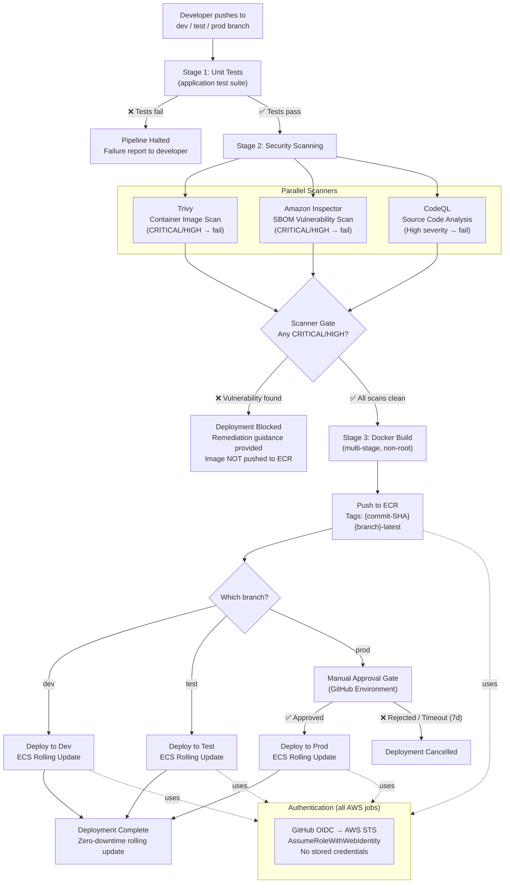

# CI/CD Pipeline Flow — ODOT AWS Web Hosting

This diagram shows the full CI/CD pipeline triggered by GitHub Enterprise Actions. The pipeline builds, scans, and deploys containerized applications to ECS Fargate clusters. It uses OIDC authentication (no stored credentials), mandatory vulnerability scanning, and a manual approval gate for production deployments.

## Pipeline Stages Summary

| Stage | Purpose | Failure Behavior |
|-------|---------|-----------------|
| **1. Unit Tests** | Validate application logic | Pipeline halts; no image built |
| **2. Security Scan** | Trivy + Inspector + CodeQL | Pipeline halts; image not pushed to ECR; remediation guidance provided |
| **3. Build & Push** | Docker build + ECR push | Pipeline halts on build failure |
| **4. Deploy** | ECS rolling update | ECS circuit breaker auto-rolls back on failure |

## Key Design Points

- **OIDC Authentication**: GitHub Actions uses `aws-actions/configure-aws-credentials@v4` with OIDC — no `AWS_ACCESS_KEY_ID` or `AWS_SECRET_ACCESS_KEY` stored in secrets.
- **Scanner Gate**: Any CRITICAL or HIGH severity finding from Trivy, Inspector, or CodeQL blocks the deployment. MEDIUM/LOW/INFORMATIONAL findings are reported but do not block.
- **Image Tagging**: Every image receives two tags — the full Git commit SHA (immutable) and `{branch}-latest` (mutable pointer).
- **Production Approval**: Prod deployments require manual approval via GitHub Environments. Approval requests expire after 7 days.
- **Zero-Downtime**: ECS rolling deployments ensure no service interruption. Circuit breaker is enabled for automatic rollback on failure.
- **SLA**: Full build-scan-deploy cycle completes within 15 minutes for non-prod stages.
