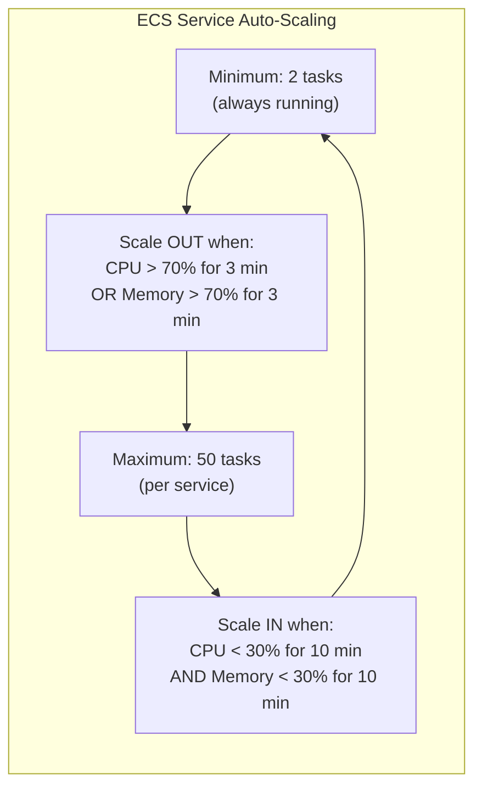

# ECS Cluster Layout — ODOT AWS Web Hosting

This diagram shows the six ECS Fargate clusters (one per stage per account), their capacity provider strategies, and how services and task definitions are organized within each cluster. All clusters are Fargate-only — no EC2 instances are managed.

```mermaid
graph TB
    %% ─── Internal Account Clusters ──────────────────────────────────────────
    subgraph Internal_Account["DOT-Web-Internal (577881328002)"]
        direction TB

        subgraph INT_DEV_CLUSTER["ECS Cluster: WebHosting-Dev"]
            INT_DEV_CP["Capacity Provider:\nFARGATE_SPOT (weight=1, base=1)\nFARGATE (weight=0)"]
            INT_DEV_INSIGHTS["Container Insights: Enabled"]

            subgraph INT_DEV_SERVICES["Services"]
                INT_DEV_SVC1["App Service A\nmin=2, max=50 tasks"]
                INT_DEV_SVC2["App Service B\nmin=2, max=50 tasks"]
                INT_DEV_SVCN["App Service N\n(scales to 100+ apps)"]
            end

            subgraph INT_DEV_TASKS["Task Definitions"]
                INT_DEV_TD_LIN["Linux Tasks\n(.NET, Node.js, Python, Java)\nread-only FS, non-root"]
                INT_DEV_TD_WIN["Windows Tasks\n(IIS/.NET Framework)\nWINDOWS_SERVER_2019_CORE\nmin 1 vCPU"]
            end
        end

        subgraph INT_TEST_CLUSTER["ECS Cluster: WebHosting-Test"]
            INT_TEST_CP["Capacity Provider:\nFARGATE_SPOT (weight=1, base=1)\nFARGATE (weight=0)"]
            INT_TEST_INSIGHTS["Container Insights: Enabled"]

            subgraph INT_TEST_SERVICES["Services"]
                INT_TEST_SVC1["App Service A\nmin=2, max=50 tasks"]
                INT_TEST_SVCN["App Service N\n(scales to 100+ apps)"]
            end
        end

        subgraph INT_PROD_CLUSTER["ECS Cluster: WebHosting-Prod"]
            INT_PROD_CP["Capacity Provider:\nFARGATE (weight=1)\nFARGATE_SPOT (weight=0)\n+ Savings Plan"]
            INT_PROD_INSIGHTS["Container Insights: Enabled"]

            subgraph INT_PROD_SERVICES["Services"]
                INT_PROD_SVC1["App Service A\nmin=2, max=50 tasks"]
                INT_PROD_SVCN["App Service N\n(scales to 100+ apps)"]
            end
        end
    end

    %% ─── External Account Clusters ──────────────────────────────────────────
    subgraph External_Account["DOT-Web-External (549136075921)"]
        direction TB

        subgraph EXT_DEV_CLUSTER["ECS Cluster: WebHosting-Dev"]
            EXT_DEV_CP["Capacity Provider:\nFARGATE_SPOT (weight=1, base=1)\nFARGATE (weight=0)"]
            EXT_DEV_INSIGHTS["Container Insights: Enabled"]

            subgraph EXT_DEV_SERVICES["Services"]
                EXT_DEV_SVC1["App Service A\nmin=2, max=50 tasks"]
                EXT_DEV_SVC2["App Service B\nmin=2, max=50 tasks"]
                EXT_DEV_SVCN["App Service N\n(scales to 100+ apps)"]
            end

            subgraph EXT_DEV_TASKS["Task Definitions"]
                EXT_DEV_TD_LIN["Linux Tasks\n(.NET, Node.js, Python, Java)\nread-only FS, non-root"]
                EXT_DEV_TD_WIN["Windows Tasks\n(IIS/.NET Framework)\nWINDOWS_SERVER_2019_CORE\nmin 1 vCPU, FARGATE only"]
            end
        end

        subgraph EXT_TEST_CLUSTER["ECS Cluster: WebHosting-Test"]
            EXT_TEST_CP["Capacity Provider:\nFARGATE_SPOT (weight=1, base=1)\nFARGATE (weight=0)"]
            EXT_TEST_INSIGHTS["Container Insights: Enabled"]

            subgraph EXT_TEST_SERVICES["Services"]
                EXT_TEST_SVC1["App Service A\nmin=2, max=50 tasks"]
                EXT_TEST_SVCN["App Service N\n(scales to 100+ apps)"]
            end
        end

        subgraph EXT_PROD_CLUSTER["ECS Cluster: WebHosting-Prod"]
            EXT_PROD_CP["Capacity Provider:\nFARGATE (weight=1)\nFARGATE_SPOT (weight=0)\n+ Savings Plan"]
            EXT_PROD_INSIGHTS["Container Insights: Enabled"]

            subgraph EXT_PROD_SERVICES["Services"]
                EXT_PROD_SVC1["App Service A\nmin=2, max=50 tasks"]
                EXT_PROD_SVCN["App Service N\n(scales to 100+ apps)"]
            end
        end
    end
```

## Auto-Scaling Configuration

Each ECS service within a cluster is configured with the following auto-scaling policies:

## Cluster Summary

| Account | Stage | Cluster Name | Capacity Provider | Spot Usage |
|---------|-------|-------------|-------------------|------------|
| Internal | Dev | WebHosting-Dev | FARGATE_SPOT (primary) | Yes — cost savings |
| Internal | Test | WebHosting-Test | FARGATE_SPOT (primary) | Yes — cost savings |
| Internal | Prod | WebHosting-Prod | FARGATE (primary) | No — stability + Savings Plan |
| External | Dev | WebHosting-Dev | FARGATE_SPOT (primary) | Yes — cost savings |
| External | Test | WebHosting-Test | FARGATE_SPOT (primary) | Yes — cost savings |
| External | Prod | WebHosting-Prod | FARGATE (primary) | No — stability + Savings Plan |

## Key Design Points

- **Fargate-Only**: No EC2 launch type permitted. All compute is serverless Fargate (Requirement 4.2).
- **Container Insights**: Enabled on all 6 clusters for CPU, memory, network, and task-level metrics (Requirement 10.1).
- **Multi-AZ**: Tasks are distributed across a minimum of 2 Availability Zones per cluster (Requirement 4.3).
- **Mixed Runtimes**: Both Linux and Windows containers coexist in the same cluster. Windows tasks require minimum 1 vCPU and always use FARGATE (not Spot) due to platform limitations.
- **Security Hardening**: Linux tasks use read-only root filesystem and non-root user (uid 1000). Windows tasks are exempt from read-only FS due to platform constraints.
- **Spot Interruption Handling**: Dev/Test tasks have `stopTimeout = 30s`. Minimum 2 tasks per service ensures availability during Spot interruptions.
- **Scalability**: Architecture supports 100+ applications per cluster without changes to the cluster or networking layer.
