# Network Topology — ODOT AWS Web Hosting

This diagram shows the network architecture for both AWS accounts (Internal and External). The Internal account uses private-only VPCs accessible via Client VPN or Direct Connect, while the External account uses public-facing VPCs with internet gateways, WAF, and Shield Standard protection on ALBs.

Each account contains three isolated VPCs (Dev, Test, Prod) in `us-east-2`, each spanning a minimum of two Availability Zones.

**Internal Account (Zero-Egress)**: No IGW, no NAT. AWS service access (ECR, CloudWatch Logs, Secrets Manager, SSM, STS) is provided via 7 VPC interface endpoints + 1 S3 gateway endpoint per VPC. All traffic stays within the AWS network.

**External Account**: Public subnets with IGW for ALBs, private subnets with NAT gateway for ECS task egress. All ALBs protected by WAF (managed rules + rate limiting) and Shield Standard. HTTPS only (TLS 1.3).

```mermaid
graph TB
    %% ─── External Traffic Sources ───────────────────────────────────────────
    Internet["Internet\n(Public Users)"]
    VPN["Client VPN /\nAWS Direct Connect\n(ODOT Corporate)"]

    %% ─── Internal Account ───────────────────────────────────────────────────
    subgraph Internal_Account["DOT-Web-Internal (577881328002)"]
        direction TB

        subgraph VPC_INT_DEV["VPC: internal-dev (10.10.0.0/16)"]
            INT_DEV_PRIV_A["Private Subnet AZ-a\n10.10.1.0/24"]
            INT_DEV_PRIV_B["Private Subnet AZ-b\n10.10.2.0/24"]
            INT_DEV_ALB["Internal ALB\n(dev)"]
            INT_DEV_ECS["ECS Fargate Cluster\nWebHosting-Dev\n(Fargate Spot)"]
        end

        subgraph VPC_INT_TEST["VPC: internal-test (10.20.0.0/16)"]
            INT_TEST_PRIV_A["Private Subnet AZ-a\n10.20.1.0/24"]
            INT_TEST_PRIV_B["Private Subnet AZ-b\n10.20.2.0/24"]
            INT_TEST_ALB["Internal ALB\n(test)"]
            INT_TEST_ECS["ECS Fargate Cluster\nWebHosting-Test\n(Fargate Spot)"]
        end

        subgraph VPC_INT_PROD["VPC: internal-prod (10.0.0.0/16)"]
            INT_PROD_PRIV_A["Private Subnet AZ-a\n10.0.1.0/24"]
            INT_PROD_PRIV_B["Private Subnet AZ-b\n10.0.2.0/24"]
            INT_PROD_ALB["Internal ALB\n(prod)"]
            INT_PROD_ECS["ECS Fargate Cluster\nWebHosting-Prod\n(On-Demand)"]
        end

        INT_NOTE["No Internet Gateway\nNo Public Subnets\nSCP: deny IGW creation"]
    end

    %% ─── External Account ───────────────────────────────────────────────────
    subgraph External_Account["DOT-Web-External (549136075921)"]
        direction TB

        subgraph VPC_EXT_DEV["VPC: external-dev (10.110.0.0/16)"]
            EXT_DEV_IGW["Internet Gateway"]
            EXT_DEV_PUB_A["Public Subnet AZ-a\n10.110.1.0/24"]
            EXT_DEV_PUB_B["Public Subnet AZ-b\n10.110.2.0/24"]
            EXT_DEV_PRIV_A["Private Subnet AZ-a\n10.110.3.0/24"]
            EXT_DEV_PRIV_B["Private Subnet AZ-b\n10.110.4.0/24"]
            EXT_DEV_ALB["External ALB\n+ WAF + Shield\n(dev)"]
            EXT_DEV_ECS["ECS Fargate Cluster\nWebHosting-Dev\n(Fargate Spot)"]
        end

        subgraph VPC_EXT_TEST["VPC: external-test (10.120.0.0/16)"]
            EXT_TEST_IGW["Internet Gateway"]
            EXT_TEST_PUB_A["Public Subnet AZ-a\n10.120.1.0/24"]
            EXT_TEST_PUB_B["Public Subnet AZ-b\n10.120.2.0/24"]
            EXT_TEST_PRIV_A["Private Subnet AZ-a\n10.120.3.0/24"]
            EXT_TEST_PRIV_B["Private Subnet AZ-b\n10.120.4.0/24"]
            EXT_TEST_ALB["External ALB\n+ WAF + Shield\n(test)"]
            EXT_TEST_ECS["ECS Fargate Cluster\nWebHosting-Test\n(Fargate Spot)"]
        end

        subgraph VPC_EXT_PROD["VPC: external-prod (10.100.0.0/16)"]
            EXT_PROD_IGW["Internet Gateway"]
            EXT_PROD_PUB_A["Public Subnet AZ-a\n10.100.1.0/24"]
            EXT_PROD_PUB_B["Public Subnet AZ-b\n10.100.2.0/24"]
            EXT_PROD_PRIV_A["Private Subnet AZ-a\n10.100.3.0/24"]
            EXT_PROD_PRIV_B["Private Subnet AZ-b\n10.100.4.0/24"]
            EXT_PROD_ALB["External ALB\n+ WAF + Shield\n(prod)"]
            EXT_PROD_ECS["ECS Fargate Cluster\nWebHosting-Prod\n(On-Demand)"]
        end

        EXT_NOTE["SCP: ALB requires WAF association\nShield Standard on all ALBs"]
    end

    %% ─── Traffic Flows ──────────────────────────────────────────────────────
    VPN --> INT_DEV_ALB
    VPN --> INT_TEST_ALB
    VPN --> INT_PROD_ALB

    Internet --> EXT_DEV_IGW
    Internet --> EXT_TEST_IGW
    Internet --> EXT_PROD_IGW

    EXT_DEV_IGW --> EXT_DEV_ALB
    EXT_TEST_IGW --> EXT_TEST_ALB
    EXT_PROD_IGW --> EXT_PROD_ALB

    %% ─── Internal ALB to ECS ────────────────────────────────────────────────
    INT_DEV_ALB --> INT_DEV_ECS
    INT_TEST_ALB --> INT_TEST_ECS
    INT_PROD_ALB --> INT_PROD_ECS

    %% ─── External ALB to ECS (tasks in private subnets) ─────────────────────
    EXT_DEV_ALB --> EXT_DEV_ECS
    EXT_TEST_ALB --> EXT_TEST_ECS
    EXT_PROD_ALB --> EXT_PROD_ECS
```

## Key Design Points

- **Internal Account**: No internet gateways, no public subnets. All traffic enters via Client VPN or AWS Direct Connect. SCP enforces this at the API level.
- **External Account**: Internet gateways in each VPC. ALBs sit in public subnets; ECS tasks run in private subnets with NAT gateway for outbound access.
- **WAF + Shield**: Every external ALB has a WAF Web ACL and Shield Standard attached. SCP prevents creating internet-facing ALBs without WAF.
- **Multi-AZ**: All VPCs span at least two Availability Zones for high availability.
- **Stage Isolation**: Each stage (Dev, Test, Prod) has its own VPC — no shared networking between stages.
